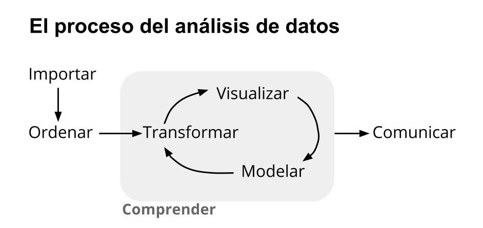

```{r include=FALSE}
knitr::opts_chunk$set(echo = TRUE, message = FALSE, warning = FALSE, dpi = 150)
```

# ¿Qué es la ciencia de datos?

La _Big Data_ ha llegado para quedarse, y asumimos que su efecto en la sociedad será permanente. Así como pasó con la escritura, los medios de comunicación o tantos otros inventos humanos de inmenso impacto cultural, el incremento en la producción y aninterálisis computacional de grandes volúmenes de datos está transformando cada una de nuestras actividades. Algunas profesiones se ven en crisis, otras se benefician, y también se crean algunas nuevas. 


Big data es un término impreciso, que se usa cuando queremos hablar de los datos que nuestra sociedad crea y procesa en forma digital, con cada vez más creciente velocidad, volumen, y variedad.


En forma acorde, _data scientist_ o "científico de datos" es también una profesión, o una actividad, que aún no está definida con toda claridad. El término, que abarca a quienes en forma cotidiana aplican técnicas de programación para analizar datos, no existía antes del 2008. Sólo cuatro años después la publicación Harvard Business Review agitó las aguas al declarar que quienes se desempeñan como científicos de datos pueden presumir de la profesión "más sexy del siglo XXI” [^1]. Títulos exagerados aparte, lo que es seguro es que la discipina ofrece un conjunto cada vez más maduro de saberes orientados a explotar datos para extraer conocimiento. Las técnicas y principios que la comunidad de la ciencia de datos ha desarrollado pueden ser aprovechados en muchos ámbitos. Entre ellos, el de las ciencias sociales, que también están en una etapa de transformación e incorporan la programación analítica como un recurso cada vez extendido. 


Avanzar las fronteras de la ciencia de datos, crear los algoritmos y técnicas informáticas que abren nuevas posibilidades de análisis es una tarea compleja, llevada a cabo por especialistas con profundos conocimientos de matemática. Y sin embargo "usar" la ciencia de datos, aplicar sus principios para resolver problemas complejos, es bastante más fácil. Para empezar sólo necesitamos paciencia para aprender algunos conceptos fundamentales de programación y estadística, empleándolos para entender y comunicar con datos. De eso se trata este libro.


## ¿Qué significa hacer ciencia de datos?

Ya dijimos que la ciencia de datos se trata de emplear técnicas de programación para analizar datos. Pero no es sólo eso; la ciencia de datos aplicada requiere el desarrollo de habilidades en cuatro áreas:

* __Programación__. Según la definición que hemos aceptado, todo científico de datos utiliza la programación para explicar a las computadoras lo que necesita de ellas. Al hacerlo, emplea el "pensamiento computacional": la habilidad de reducir una tarea compleja a una serie de pasos que pueden resolverse con código interpretado por una computadora. Aclaremos por si hiciera falta que no todos los problemas son solubles por medios computacionales, pero muchos lo son, al menos en parte. El científico de datos pone en práctica algunas técnicas de programación (o muchas, según el grado de especialización) para resolver problemas que sería impráctico abordar de otro modo.

* __Estadística__. ¡Inescapable! También poderosa, a veces anti-intuitiva, cuando tenemos suerte reveladora. La estadística es muchas cosas, pero -a pesar de su mala fama- aburrida jamás. Sólo es cuestión de amigarse con ella. Vamos a necesitarla para extraer conocimiento de los datos. Es sorprendente lo mucho que puede lograrse con sólo unos rudimentos (media, mediana, desvío estándar y cuartiles) y de allí en más sólo es cuestión de profundizar paso a paso.

* __Comunicación__. Un científico de datos combina habilidades "duras" con otras que requieren empatizar con los demás: las que se relacionan con la comunicación y la colaboración interdisciplinaria. Encontrar la forma de explicar procesos complejos, de llevar las revelaciones de un modelo estadístico a términos que tengan sentido para un público amplio, crear visualizaciones que permitan a terceros "leer" los datos y sacar conclusiones por su cuenta. Parte de hacer ciencia de datos es saber cómo discutir los datos usados y los resultados obtenidos con interlocutores muy diversos: audiencia general, funcionarios públicos, colegas, especialistas de otras disciplinas, etcétera.

* __Conocimiento de dominio__. El conocimiento de dominio es la experiencia acumulada en un campo particular de actividad humana: agricultura, relaciones públicas, física cuántica, crianza de niños. Complementa de forma imprescindible a las habilidades analíticas. El conocimiento de dominio no sólo ayuda a discernir si las respuestas obtenidas mediante un sofisticado análisis estadístico tienen sentido. También es necesario para saber cuáles son las preguntas que deberíamos estar haciendo. 


Las cuatros habilidades entran en acción en cada proyecto que involucra ciencia de datos, en mayor o menor medida de acuerdo a la etapa de análisis. Hablando de etapas, Hadley Wickham, uno de los referentes actuales en el campo, las define así:

```{r echo=FALSE, fig.cap="etapas en la aplicación de ciencia de datos"}

```


Y todo ello llevado a cabo mediante la programación, por supuesto. 

A lo largo de los capítulos de este libro vamos a aprender técnicas de programación que nos permitan atravesar cada uno de los pasos del proceso, y al hacerlo estaremos ejercitando las cuatro habilidades que la ciencia de datos involucra. 

Allá vamos.


