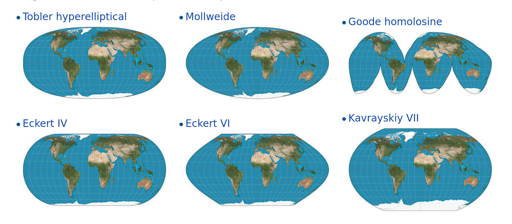

# Información geográfica y mapas

Hemos llegado al capítulo final, dedicado al análisis y visualización de información geográfica. Aquí incursionaremos en el dominio de los _SIG_ ("Sistemas de Información Geográfica") también conocidos como _GIS_ por sus siglas en inglés.

Hasta hace poco tiempo, labores como la producción de mapas y el análisis espacial estaban reservadas para especialistas, debido a la complejidad de las tareas y al alto costo de producción y adquisición de datos geográficos. Pero durante las dos últimas décadas la tecnología digital cambió el panorama. Una dramática caída en el costo asociado a adquirir y procesar información geográfica (pensemos en satélites y computadoras multiplicándose y bajando de precio) dio paso al mapa digital como herramienta universal. El consumo de sofisticados mapas y otros productos geográficos se volvió masivo y cotidiano, con Google Maps como el exponente más conocido. Apenas había pasado la novedad de disponer de mapas en alta resolución de todo el mundo accesibles al instante desde nuestros escritorios, cuando la llegada de los _smartphones_ popularizó el acceso en cualquier momento y lugar.

El mismo proceso que nos convirtió a todos en consumidores constantes de información geográfica también nos da la oportunidad de ser los productores. Sin dudas, hacer mapas se ha vuelto más fácil que nunca antes. Existen cada vez más repositorios con información georreferenciada de acceso publico -datasets que incluyen información precisa sobre su ubicación geográfica. Al mismo tiempo, maduran y se hacen más fáciles de usar las herramientas para análisis y visualización espacial. 

En los procesos sociales, el "dónde" suele ser un aspecto clave. Es central para quienes estudiamos -por ejemplo- las ciudades o las dinámicas de la política, siempre tan arraigadas a lo territorial. Esto vuelve al mapa una de las herramientas de visualización más importantes que podemos emplear.

En R contamos con varios paquete de funciones que permiten manipular información espacial con facilidad. A continuación vamos a aprender a combinarlos con las herramientas que ya hemos aprendido, para hacer análisis geográfico y crear nuestros propios mapas.

## Los datos georreferenciados

El atributo que distingue a los datos georreferenciados, lo que los hace merecer ese nombre, es que representan ubicaciones exactas sobre la superficie de la Tierra. Representar en forma precisa una posición sobre la superficie terrestre es un todo un reto. Para empezar, la Tierra tiene una forma irregular. A pesar de cómo solemos imaginarla y dibujarla, no es una esfera perfecta sino que está "achatada" en los polos, dificultando la matemática necesaria para comparar posiciones y medir distancias. Luego, está el problema de cómo mostrar sobre papel impreso, o en una pantalla digital, -superficies planas- rasgos geográficos que pertenecen a una superficie tridimensional esférica. La solución a estos problemas toma la forma de sistemas de coordenadas de referencia (_CRS_ por sus siglas en inglés), y de proyecciones cartográficas. 

Los CRS son un sistema de números que definen ubicaciones sobre la superficie de la Tierra; funcionan como direcciones. El tipo de CRS más conocido es el que usa latitud y longitud, para definir posiciones en los ejes norte-sur y este-oeste.

Las proyecciones cartográficas son instrucciones para traducir a un plano la disposición de puntos ubicados en la esfera terrestre. Algo así como las instrucciones para dibujar en dos dimensiones las disposición de fronteras, accidentes geográficos, calles o cualquier otro objeto que se extiende sobre la superficie curva del planeta. Como en toda traducción, hay algo que se pierde en el proceso. Todo los mapas "mienten", en el sentido en que presentan una versión distorsionada de la superficie de terrestre. Esto es inevitable; no existe forma de pasar de la esfera al plano sin distorsionar la forma, la superficie, la distancia o la dirección de los rasgo geográficos. Existen muchísimas proyecciones distintas, cada una pensada para minimizar alguno de los tipos de distorsión, o para encontrar una solución de compromiso que los balancee.

```{r echo=FALSE, fig.cap="Distintos sistemas de proyección cartográfica (cortesía Daniel R. Strebe 2011)", out.width="100%"}

```

La proyección más famosa es la Mercator, diseñada para asistir la navegación marítima y en uso desde el siglo XVI. Su fuerte es que no distorsiona las direcciones, por lo que permite fijar el rumbo de navegación consultando el mapa. Su principal problema es que produce una distorsión notable en las áreas cercanas a los polos: Groenlandia aparenta el mismo tamaño que toda África, cuando en realidad tiene sólo un quinceavo de su superficie. Por esa razón perdió la proyección popularidad en el siglo XX cuando comenzaron a preferirse proyecciones que respetan las áreas, como las de la Figura 6.1. Sin embargo, en el siglo XXI la proyección Mercator recuperó protagonismo. Google la eligió para sus mapas en línea, y por razones de compatibilidad otros proveedores de mapas digitales la adoptaron también. Así, y para inconsolable irritación de los geógrafos, Mercator se convirtió en el estándar de facto para aplicaciones geográficas en la web. 

```{r echo=FALSE, fig.cap="La inescapable proyección Mercator (cortesía Jecowa)", out.width="100%"}
knitr::include_graphics('imagenes/Mercator-proj.png')
```

En la práctica, si trabajamos en forma frecuente con archivos georreferenciados vamos a sufrir tarde o temprano de problemas de coordenadas o proyección. El más común de ellos: tener una fuentes de datos geográficos que no podemos comparar con otras, porque desconocemos el sistema de coordenadas que se usó para crearla; es decir, no podemos saber a que posición sobre el planeta corresponde cada observación en los datos.


## Formatos de archivo 

Otro problema asociado a trabajar con datos geográficos es el de los formatos de archivo. El formato más común es el denominado "shapefile", inventado por la empresa ESRI (los creadores del software ArcGIS). Es un formato incómodo porque guarda la información en varios archivos distintos, que suelen ser combinados en un archivo .zip para su distribución. Un inconveniente aún mayor es que los nombres de las variables en un shapefile deben tener 10 caracteres o menos, lo que facilita el uso de abreviaturas ininteligibles. A pesar de éstos y otros detrimentos, el formato es tan común que se ha vuelto sinónimo de archivo con información geográfica, y resiste a pesar de los esfuerzos por reemplazarlo con alternativas más modernas. Una de ellas es "GeoJSON", un estándar abierto que corrige los dos inconvenientes mencionados antes. Para nuestros ejercicios usaremos datos geográficos en esta último formato.


## Explorando un archivo con información geográfica

Como hemos hecho antes, practicaremos con datos tomados del portal de datos abiertos de la Ciudad de Buenos Aires. En esta ocasión se trata de los radios censales de la ciudad. Los radios censales son particiones de la superficie de la ciudad que contienen una cantidad similar de hogares. Fueron definidos por el Instituto Nacional de Estadística y Censos (INDEC) para facilitar la labor durante la jornada del Censo Nacional de Población que se realiza cada diez años. La idea es asignar a cada censista un radio censal, estimando que puede recorrer todos los hogares incluidos durante el día. Los radios censales son la unidad de análisis espacial por excelencia, debido a que combinan alta granularidad con abundante información asociada de acceso público, producida como resultado del Censo.

A trabajar entonces. Si no lo hicimos aún, carguemos las librerías `sf` y `tidyverse`

```{r eval=FALSE}
library(sf)
library(tidyverse)
```

Y leemos los datos directo desde internet:

```{r}

radios <- st_read("https://bitsandbricks.github.io/data/CABA_rc.geojson")

```

Dediquemos un momento para describir la información que apareció al leer el archivo.

- `Simple feature collection with 3554 features and 8 fields`: Cargamos una colección de "simple features" (entidades geométricas en la jerga de la cartografía digital), compuesta por 3554 rasgos y 8 campos, que se traduce como 3554 observaciones/filas con 8 variables/columnas.
- `geometry type:  MULTIPOLYGON`: los archivos con información geográfica contienen colecciones de puntos, de líneas, o de polígonos. En éste caso son polígonos; tiene sentido para la información que esperamos, que es la de la superficie de Buenos Aires dividida en sus radios censales.
- `dimension:      XY`: la información es "plana", en dos dimensiones X e Y. No incluye información de alturas, que estaría en la dimensión Z. Es lo típico, rara vez trabajaremos con archivos tridimensionales.
- `bbox:           xmin: -58.53092 ymin: -34.70574 xmax: -58.33455 ymax: -34.528`: nos da cuatro valores que forman una "caja" (_bounding box_), el rectángulo que contiene todos los datos. Estos valores son la latitud mínima, la longitud mínima, la latitud máxima y la longitud máxima del conjunto de datos. Sólo es útil cuando tenemos mucha práctica y ya reconocemos lugares por sus coordenadas.
- `epsg (SRID):    4326` y `proj4string:    +proj=longlat +datum=WGS84 +no_defs` significan lo mismo, que nuestros datos usan el sistema de coordenadas WGS84, también conocido por su código EPSG 4326 . Es el mismo que usan los sistemas GPS, Google Maps, y las aplicaciones de internet en general. Es importante prestar atención al sistemas de coordenadas, o CRS, ya que para comparar datos geográficos de distintas fuentes todas deben usar el mismo.

Como con cualquier otro dataset, comenzamos nuestra exploración pidiendo su resumen: 

```{r}
summary(radios)
```

Podemos sacar en limpio varias cosas. RADIO_ID, por su nombre, debe ser el código que identifica cada radio censal. Tenemos columnas representando barrio y comuna de cada radio. Tenemos una columna para la población, y vemos que así como algún radio está deshabitado, el más poblado alcanza los 3945 habitantes. En cantidad de viviendas, el máximo es de 1405, y el de hogares 1093: eso significa que existe al menos un radio censal donde hay viviendas desocupadas; tomamos nota para revisarlo luego. "HOGARES_NBI" representa la cantidad de hogares donde se registró que al menos una de las necesidades básicas no estaba satisfecha, con mínimo de 0 por radio, y máximo nada menos que de 403. También tenemos una columna con el área en km^2, que muestra que en general los radios censales abarcan alrededor de medio kilómetro cuadrado, pero existe alguno que es casi 8 veces mayor al promedio. Por último queda la columna `geometry`, que contiene una serie de puntos que permiten trazar la silueta de cada radio (sus polígonos). Nosotros no vamos a prestarle atención, pero para R es fundamental, ya que le permite proyectar mapas y hacer cálculos geométricos cuando se lo pidamos.
 
 
## Visualizando información geográfica

La visualización de información geográfica por excelencia es el mapa, ¡por supuesto!

Nuestro aliado `ggplot()` se encarga de ello.

```{r}
ggplot() + geom_sf(data = radios)
```

Ademas de encontrarnos con la reconocible silueta de la ciudad, comprobamos lo que el resumen de la data había sugerido: la mayoría de los radios censales tiene un tamaño similar, pero existe un puñado que es considerablemente más extenso que el promedio. Los "mega radios" seguramente corresponden a zonas poco habitadas, por lo que se asume que un censista puede terminar de encuestar a todos los residentes en un día.

Podemos analizar eso mismo: ¿cuántas viviendas hay por radio?

```{r}
ggplot() + geom_sf(data = radios, aes(fill = VIVIENDAS)) 
```

EL grosor de la línea que traza las fronteras entre radios hace difícil determinar el color de relleno. Esto suele pasar cuando se grafica información geográfica intrincada como la de los radios censales. Una solución es definir el color de la línea como `NA`, que para `ggplot` significa "ninguno". Lo hacemos así:

```{r}
ggplot() + geom_sf(data = radios, aes(fill = POBLACION), color = NA)
```

Así esta mejor. Nótese que definimos el color por fuera de `aes()`. Cuando queremos asignar un valor fijo a alguno de los atributos estéticos (y no dependiente de una variable) siempre va fuera de la función `aes()`.

En cuanto al gráfico, observamos que los radios censales más grandes tienden a ser poco poblados, con algunas excepciones, en particular el gran radio censal al oeste. ¿A qué barrio corresponde?

```{r}
ggplot() + geom_sf(data = radios, aes(fill = BARRIO), color = NA)
```

Hemos logrado otro de nuestros gráficos ilegibles, intentando mostrar demasiadas variables categóricas a la vez. Una forma de resolver el dilema es filtrando los datos para aislar los casos de interés. Del menú de visualizaciones que aprendimos en el capítulo 2, podemos elegir el histograma para mostrar la distribución de tamaños de nuestros radios censales.

```{r}
ggplot() + geom_histogram(data = radios, aes(x = AREA_KM2))
```

Cómo había anticipado el resumen vía `summary()`, la gran mayoría de los radios tiene menos de medio km^2. Unos pocos superan los 2 km^2, así que vamos a aislar esos para saber a que barrio corresponden.


```{r}
filtrados <- radios %>% 
    filter(AREA_KM2 > 2) 

ggplot() + 
    geom_sf(data = filtrados, aes(fill = BARRIO)) +
    labs(title = "Radios censales de mayo tamaño")
```
Nuestro gran radio censal al este, con población considerable, corresponde a Puerto Madero.


Llevemos ahora nuestra atención al tema de la cantidad de viviendas superando a la de hogares. Tal situación implica que hay una tasa de vacancia alta en el radio censal. Podemos verla en el mapa graficando la intensidad de la relación entre viviendas y hogares, expresándola como la división de una por otra.

```{r}
ggplot() + geom_sf(data = radios, aes(fill = VIVIENDAS/HOGARES), color = NA)
```

Hay un radio censal que parece brillar, destacándose entre los demás. ¿Dónde está? Esta vez lo resolvemos en forma analítica en lugar de visual, usando los verbos de transformación de datos. Vamos a definir una variable nueva, con la tasa entre viviendas y hogares que ya usamos para el gráfico. Luego vamos a ordenar el dataframe por orden descendiente de la tasa, y usando `head()` nos quedamos sólo con los primeros valores, que corresponden a los más altos:

```{r}
radios %>% 
    mutate(viv_vs_hogares = VIVIENDAS / HOGARES) %>% 
    arrange(desc(viv_vs_hogares)) %>% 
    head()

```

Otra vez Puerto Madero, que contiene un radio censal con una vacancia notable, el segundo de la lista: con 473 viviendas disponibles, se asentaron allí sólo 20 hogares. El que se llevó el primer puesto, también en Puerto Madero, obtuvo una tasa de "Inf", o infinito. Esto ocurre porque allí tenemos 0 hogares, y al dividir por esa cantidad no se obtiene un número. Conociendo al barrio, podemos sospechar que la especulación inmobiliaria es la causa de las viviendas vacías. El resto de los radios censales del ranking corresponde a San Nicolás, el barrio más céntrico de la ciudad, donde la gran cantidad de departamentos dedicados a uso comercial o profesional explicaría la baja cantidad de hogares.

Algo importante que no hemos mencionado aún es la importancia de "normalizar" las variables antes de mostrarlas en un mapa. Con esto me refiero a que, en general, no interesan tanto los valores absolutos sino puestos en contexto. Ejemplos típicos: 

* En lugar de mostrar "número de crímenes por barrio" es más instructivo mostrar el número de crímenes per cápita; de lo contrario es de esperar que los lugares más poblados siempre estén a la cabeza, lo cual no agrega demasiada información.  
* En lugar de mostrar "cantidad de habitantes por radio censal", suele preferirse mostrar la densidad de población, es decir la cantidad de habitantes dividida por la extensión del área. Los mapas de densidad muestran mucho mejor la distribución espacial de la población.


Con nuestros datos, podemos visualizar la densidad de la población así:

```{r}
ggplot() + 
    geom_sf(data = radios, aes(fill = POBLACION/AREA_KM2), color = NA) +
    scale_fill_viridis_c() +
    labs(title = "Densidad de población",
         subtitle = "Ciudad Autónoma de Buenos Aires",
         fill = "hab/km2")
```

Este último gráfico representa de forma mucho mas precisa la distribución de habitantes en la ciudad, haciendo saltar a la vista los núcleos con mayor densidad de población. De paso, aprendimos un truco nuevo: agregando `scale_fill_viridis_c()` le pedimos a `ggplot` que utilice la escala de colores conocida como "viridis", diseñada por expertos en visualización para ser fácil de leer... y lucir bien.


## Volcando en el mapa información de múltiples fuentes

En algunos casos, un archivo con información geográfica contiene todos los datos que necesitamos. Pero lo habitual es que el archivo sólo brinde la ubicación y fronteras de nuestras unidades de análisis, de manera que necesitamos agregarle los datos que hemos obtenido de otras fuentes y queremos proyectar en un mapa.

En el capítulo 2 aprendimos a usar la función `left_join()` para combinar tablas. Dado que los datos espaciales cargados vía `sf()` son dataframes -tablas-, podemos usarla para agregar variables a nuestros radios censales. Por ejemplo, las del dataset de interacciones de la ciudadanía con la ciudad.

Lo cargamos,

```{r eval=FALSE}
atencion_ciudadano <- read.csv("http://bitsandbricks.github.io/data/gcba_suaci_comunas.csv")
```

y recordamos que sus variables son:

```{r}
names(atencion_ciudadano)
```

Un momento. Las variables que identifican el lugar de un reclamo son las de barrio y comuna, pero la unidad de análisis de nuestro archivo espacial es el radio censal. ¿Cómo podemos cruzar los datos? Por suerte para nosotros, el dataset con los radios censales incluye columnas con barrio y comuna, así que las podemos usar para el cruce. Si no dispusiéramos de esa información, hubiéramos tenido que tomar el camino largo. Este consiste en conseguir un archivo espacial que contenga los límites de los barrios (o comunas) y hacer una operación llamada _spatial join_ para cruzar los datos en base a sus coordenadas geográficas. La "unión espacial" permite poner condiciones como "unir los datos X con los datos Y en caso de que X esté _adentro_ de Y". Nosotros no vamos a necesitar recurrir a un _spatial join_, pero es bueno saber que la opción existe (la función es `st_join()`) en caso de que la necesitemos en el futuro.

Para poder cruzar las tablas de atención ciudadana y la de datos espaciales, necesitamos que la unidad de observación (la entidad que representa cada fila) sea la misma. Cómo el dataset de atención es el menos detallado a nivel espacial, corresponde hacer un agregado de los radios censales para calcular sus datos a nivel barrio o comuna. Vamos con los barrios, usando a nuestros viejos amigos `group_by` y `summary`.

Recordemos los nombres de columna de `radios`:

```{r}
names(radios)
```

Todas las unidades numéricas representan valores absolutos (no proporciones) así que es fácil pasarlas a un agregado por barrio; basta con sumarlas.

```{r}
barrios_geo <- radios %>% 
    group_by(BARRIO) %>% 
    summarise(POBLACION = sum(POBLACION),
              VIVIENDAS = sum(VIVIENDAS),
              HOGARES = sum(HOGARES),
              HOGARES_NBI = sum(HOGARES_NBI),
              AREA_KM2 = sum(AREA_KM2))
```

Y esto es lo lindo de trabajar con datos geográficos en forma de tabla: la columna `geometry`, la que guarda la información espacial, se crea en forma automática al hacer el `summarise`, y contiene la fronteras de la unidad de agregación - los barrios. 


```{r}
ggplot() + geom_sf(data = barrios_geo)
```

Como efecto secundario de la operación (que en la jerga del _GIS_ se conoce como "disolver polígonos") podemos ver algunas líneas internas que han quedado como residuo de la unión de los radios censales. Es un problema muy común al trabajar con datos geográficos, dependiendo de la calidad de la fuente. Por suerte, en este caso el pequeño desperfecto no afecta nuestros planes. En pos de la prolijidad, podríamos realizar un ajuste fino y eliminar esas líneas internas, ya que hay varias técnicas para ello. Pero la complejidad de la tarea haría demasiado larga la explicación, así que vamos a dejarlo así... un recordatorio de que al trabajar con datos "reales" pasan estas cosas.

Ahora hagamos también un agregado por barrio de los datos de atención al ciudadano,

```{r}
atencion_por_barrio <- atencion_ciudadano %>% 
    group_by(BARRIO) %>% 
    summarise(total = sum(total))

head(atencion_por_barrio)
```

Ya tenemos las piezas necesarias: dos datasets con una columna en común que los relaciona ("BARRIO") permitiendo cruzar los datos. Queremos conservar todas las observaciones del dataset geográfico, agregando los datos contenidos en el dataset de atención en donde la variable BARRIO sea la misma.

```{r}
barrios_geo <- barrios_geo %>% left_join(atencion_por_barrio)
```

¡Ahora podemos hacer un mapa de cantidad de contactos por barrio!

```{r}
ggplot() + geom_sf(data = barrios_geo, aes(fill = total))
```

Tal como habíamos verificado cuando hicimos la exploración del dataset en el capítulo 2, en los barrios céntricos se registra la mayoría de los contactos. Podemos mejorar un poco el mapa, normalizando los datos para mostrar valores per cápita.

```{r}
ggplot() + 
    geom_sf(data = barrios_geo, aes(fill = total/POBLACION)) +
    labs(title = "Contactos a atención ciudadana per cápita",
         subtitle = "Barrios de Ciudad Autónoma de Buenos Aires",
         fill = "contactos/habitante")
```

Normalizar los datos hace evidente que los barrios son parejos en su grado de demanda por habitante, exceptuando los casos salientes que mencionamos antes.

Hasta ahora hemos mostrado sobre un mapa variables numéricas, pero es igual de fácil representar variables categóricas. Imaginemos que quisiéramos mostrar el principal rubro por el cual se comunican los ciudadanos en cada barrio.

Usando los verbos de transformación que conocemos, la receta sería:

1. Agrupar los datos por barrio y por rubro
2. Crear un resumen con el total de contactos por rubro en cada barrio
3. Por cada grupo, filtrar los datos para conservar sólo el rubro que tiene la cantidad más grande de contactos

```{r}
atencion_por_barrio_principal_rubro <- atencion_ciudadano %>% 
    group_by(BARRIO, RUBRO) %>% 
    summarise(contactos = sum(total)) %>% 
    filter(contactos == max(contactos))

head(atencion_por_barrio_principal_rubro)
```

Como funciona esta cadena de verbos? 

1. `group_by()` agrupa los datos por barrio, y para cada barrio agrupa los datos por rubro. 

2. `summarise()` "pela" una capa de agrupamiento, la más externa que es rubro, y deja para cada barrio una sola fila por rubro, con la suma de sus totales.

3. El paso final en la cadena de transformación, `filter(contactos == max(contactos))` funciona porque todos los verbos de transformación respetan el agrupamiento. Es decir, si los datos fueron agrupados en forma previa, la función `filter()` aísla la fila con la cantidad máxima de contactos en cada uno de los grupos. En este caso, el agrupamiento que le llega a `filter()` es sólo por "BARRIOS", porque la función `summarise()` borró la capa "RUBRO". Resultado final: por cada barrio, una única fila que contiene el rubro que sumó más contactos


Agregamos la información al dataset geográfico vía `left_join()`

```{r}
barrios_geo <- barrios_geo %>% left_join(atencion_por_barrio_principal_rubro)
```

Y mostramos el rubro principal por barrio en un mapa

```{r}
ggplot() + 
    geom_sf(data = barrios_geo, aes(fill = RUBRO)) +
    labs(title = "Principal categoría de las solicitudes/reclamos")
```

## Combinando capas geográficas

Comentamos al principio de capítulo que los archivos con datos espaciales pueden representar áreas (polígonos), líneas o puntos. Hasta ahora hemos hecho mapas con polígonos, pero según el caso podríamos querer mostrar otros tipos de geometría. 

Un ámbito donde es común utilizar toda la variedad de geometrías es el transporte: Polígonos para representar distritos, líneas para el recorrido de un sistema de transporte, y puntos para la ubicación de las estaciones.

Una vez más, el portal de datos abiertos de la Ciudad de Buenos Aires nos provee los datos necesarios para practicar. De allí he descargado, y preparado para su uso, datos espaciales con

    las líneas de transporte subterráneo (SUBTE) de la ciudad
    
```{r}
subte_lineas <- st_read("http://bitsandbricks.github.io/data/subte_lineas.geojson")
```

    y los puntos con las ubicaciones de las estaciones de SUBTE
    
```{r}
subte_estaciones <- st_read("http://bitsandbricks.github.io/data/subte_estaciones.geojson")
```

Combinar capas mostrado distintas geometrías es simple usando `sf()` y `ggplot()`. Sólo es cuestión de sumar capas de `geom_sf()` con cada fuente de datos:

```{r}
ggplot() +
    geom_sf(data = barrios_geo) +
    geom_sf(data = subte_lineas, color = "yellow") +
    geom_sf(data = subte_estaciones, color = "orange") +
    labs(title = "Sistema de transporte subterráneo (SUBTE)",
         subtitle = "Ciudad de Buenos Aires")
```

¡Voilà! Podríamos también aprovechar el lienzo en blanco de la superficie de los barrios para hacer un mapa temático que muestre la cantidad de incidentes en la base de atención ciudadana relacionados con el SUBTE. 

Para revisar todos los rubros de atención, podemos usar `summary(atencion_ciudadano$RUBRO)`; en lugar de pedir un resumen del dataframe completo, le estamos indicando a R que nos interesa el detalle de la columna "RUBRO". Entre las 346 categorías, una es "EMERGENCIAS EN SUBTE". Suena interesante. 

¿Dónde se han registrado más incidentes con emergencias? Lo responderemos con un mapa. A priori asumimos que no vamos a encontrar casos en en los barrios por donde no pasa el SUBTE, lo cual también podremos comprobar.  


Primero creamos un subconjunto de los datos con la suma, por barrio, de emergencias reportadas

```{r}
emergencias_en_subte <- atencion_ciudadano %>% 
    filter(RUBRO == "EMERGENCIAS EN SUBTE") %>% 
    group_by(BARRIO) %>% 
    summarise(emergencias = sum(total))

```


... luego lo cruzamos con nuestro archivo geográfico

```{r}
barrios_geo <- barrios_geo %>% left_join(emergencias_en_subte)
```

... y creamos un mapa temático mostrando la suma de emergencias por barrio:

```{r}
ggplot() +
    geom_sf(data = barrios_geo, aes(fill = emergencias)) +
    geom_sf(data = subte_lineas, color = "yellow") +
    geom_sf(data = subte_estaciones, color = "orange") +
    labs(title = "Emergencias relacionadas con el SUBTE",
         subtitle = "Registros de atención al ciudadano, Ciudad de Buenos Aires (2015 - 2017)",
         fill = "emergencias reportadas")
```

Aquí se cumplen las expectativas: la cantidad de emergencias reportadas sigue en forma clara un patrón relacionado con la cantidad de estaciones ubicadas en cada barrio. Y como era de esperarse, en barrios donde el SUBTE no ofrece cobertura la cantidad de emergencias es nula.

Con eso cerramos el capítulo, y el manual. 

Mi mensaje final es fácil de resumir. Espero que "Ciencia de Datos y Políticas Públicas" haya sido una introducción satisfactoria al análisis, modelado y visualización de información, y tan sólo el inicio de un largo y gratificante recorrido.

¡Gracias por haber leído hasta aquí! 
