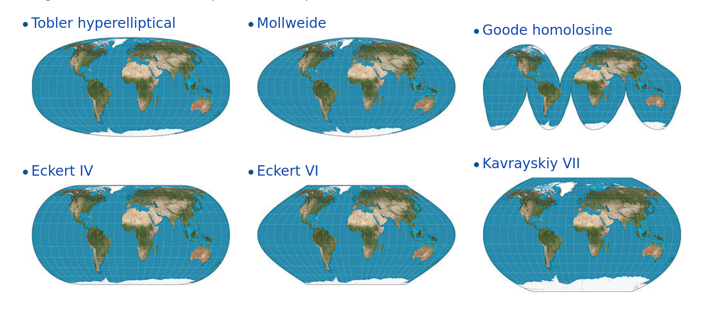

--- 
title: "Ciencia de Datos y Políticas Públicas"
author: "Antonio Vazquez Brust"
date: "`r Sys.Date()`"
bibliography:
- book.bib
- packages.bib
documentclass: book
github-repo: datosgcba/ciencia-de-datos-politicas-publicas
link-citations: yes
site: bookdown::bookdown_site
subtitle: Una introducción a la exploración, análisis y visualización de datos
biblio-style: apalike
---

# {-}

```{r echo=FALSE, out.width="100%"}
knitr::include_graphics('imagenes/portada.png')
```

Éste manual es una ["bifurcación"](https://es.wikipedia.org/wiki/Bifurcaci%C3%B3n_(desarrollo_de_software)) de [Ciencia de Datos para Gente Sociable](https://bitsandbricks.github.io/ciencia_de_datos_gente_sociable/). 

Su antecesor fue escrito para urbanistas, sociólogos, politólogas y otros entusiastas que se acercan al tema desde las Ciencias Sociales; éste manual también, pero ajustado a una audiencia en particular: empleados y funcionarios del Gobierno de la Ciudad de Buenos Aires.


## Antes de empezar {-}

Para practicar los ejemplos que se explicarán a lo argo del libro no hace falta ningún conocimiento previo de programación; todas las herramientas necesarias serán explicadas sobre la marcha. 

Sólo es necesario instalar el [lenguaje de programación R](https://cloud.r-project.org/), y la interfaz gráfica [RStudio Desktop](https://www.rstudio.com/products/rstudio/download/). 

```{r include=FALSE}
# automatically create a bib database for R packages
knitr::write_bib(c(
  .packages(), 'bookdown', 'knitr', 'rmarkdown'
), 'packages.bib')
```

<!--chapter:end:index.Rmd-->

---
title: "01-intro.Rmd"
author: "Antonio Vázquez Brust"
date: "January 17, 2018"
output: html_document
---

```{r include=FALSE}
knitr::opts_chunk$set(echo = TRUE, message = FALSE, warning = FALSE, dpi = 150)
```

# ¿Qué es la ciencia de datos?

La _Big Data_ ha llegado para quedarse, y asumimos que su efecto en la sociedad será permanente. Así como pasó con la escritura, los medios de comunicación o tantos otros inventos humanos de inmenso impacto cultural, el incremento en la producción y análisis computacional de grandes volúmenes de datos está transformando cada una de nuestras actividades. Algunas profesiones se ven en crisis, otras se benefician, y también se crean algunas nuevas. 


Big data es un término impreciso, que se usa cuando queremos hablar de los datos que nuestra sociedad crea y procesa en forma digital, con cada vez más creciente velocidad, volumen, y variedad.


En forma acorde, _data scientist_ o "científico de datos" es también una profesión, o una actividad, que aún no está definida con toda claridad. El término, que abarca a quienes en forma cotidiana aplican técnicas de programación para analizar datos, no existía antes del 2008. Sólo cuatro años después la publicación Harvard Business Review agitó las aguas al declarar que quienes se desempeñan como científicos de datos pueden presumir de la profesión "más sexy del siglo XXI” [^1]. Títulos exagerados aparte, lo que es seguro es que la discipina ofrece un conjunto cada vez más maduro de saberes orientados a explotar datos para extraer conocimiento. Las técnicas y principios que la comunidad de la ciencia de datos ha desarrollado pueden ser aprovechados en muchos ámbitos. Entre ellos, el de las ciencias sociales, que también están en una etapa de transformación e incorporan la programación analítica como un recurso cada vez extendido. 


Avanzar las fronteras de la ciencia de datos, crear los algoritmos y técnicas informáticas que abren nuevas posibilidades de análisis es una tarea compleja, llevada a cabo por especialistas con profundos conocimientos de matemática. Y sin embargo "usar" la ciencia de datos, aplicar sus principios para resolver problemas complejos, es bastante más fácil. Para empezar sólo necesitamos paciencia para aprender algunos conceptos fundamentales de programación y estadística, empleándolos para entender y comunicar con datos. De eso se trata este libro.


## ¿Qué significa hacer ciencia de datos?

Ya dijimos que la ciencia de datos se trata de emplear técnicas de programación para analizar datos. Pero no es sólo eso; la ciencia de datos aplicada requiere el desarrollo de habilidades en cuatro áreas:

* __Programación__. Según la definición que hemos aceptado, todo científico de datos utiliza la programación para explicar a las computadoras lo que necesita de ellas. Al hacerlo, emplea el "pensamiento computacional": la habilidad de reducir una tarea compleja a una serie de pasos que pueden resolverse con código interpretado por una computadora. Aclaremos por si hiciera falta que no todos los problemas son solubles por medios computacionales, pero muchos lo son, al menos en parte. El científico de datos pone en práctica algunas técnicas de programación (o muchas, según el grado de especialización) para resolver problemas que sería impráctico abordar de otro modo.

* __Estadística__. ¡Inescapable! También poderosa, a veces anti-intuitiva, cuando tenemos suerte reveladora. La estadística es muchas cosas, pero -a pesar de su mala fama- aburrida jamás. Sólo es cuestión de amigarse con ella. Vamos a necesitarla para extraer conocimiento de los datos. Es sorprendente lo mucho que puede lograrse con sólo unos rudimentos (media, mediana, desvío estándar y cuartiles) y de allí en más sólo es cuestión de profundizar paso a paso.

* __Comunicación__. Un científico de datos combina habilidades "duras" con otras que requieren empatizar con los demás: las que se relacionan con la comunicación y la colaboración interdisciplinaria. Encontrar la forma de explicar procesos complejos, de llevar las revelaciones de un modelo estadístico a términos que tengan sentido para un público amplio, crear visualizaciones que permitan a terceros "leer" los datos y sacar conclusiones por su cuenta. Parte de hacer ciencia de datos es saber cómo discutir los datos usados y los resultados obtenidos con un interlocutores muy diversos: audiencia general, funcionarios públicos, colegas, especialistas de otras disciplinas, etcétera.

* __Conocimiento de dominio__. El conocimiento de dominio es la experiencia acumulada en un campo particular de actividad humana: agricultura, relaciones públicas, física cuántica, crianza de niños. Complementa de forma imprescindible a las habilidades analíticas. El conocimiento de dominio no sólo ayuda a discernir si las respuestas obtenidas mediante un sofisticado análisis estadístico tienen sentido. También es necesario para saber cuáles son las preguntas que deberíamos estar haciendo. 


Las cuatros habilidades entran en acción en cada proyecto que involucra ciencia de datos, en mayor o menor medida de acuerdo a la etapa de análisis. Hablando de etapas, Hadley Wickham, uno de los referentes actuales en el campo, las define así:

```{r echo=FALSE, fig.cap="etapas en la aplicación de ciencia de datos"}
knitr::include_graphics('imagenes/proceso_ciencia_datos.jpg')
```


Y todo ello llevado a cabo mediante la programación, por supuesto. 

A lo largo de los capítulos de este libro vamos a aprender técnicas de programación que nos permitan atravesar cada uno de los pasos del proceso, y al hacerlo estaremos ejercitando las cuatro habilidades que la ciencia de datos involucra. 

Allá vamos.


<!--chapter:end:01-intro.Rmd-->


# Una presentación a toda marcha de R

`R` es un lenguaje de programación especializado en análisis y visualización de datos. Es un producto de código abierto, lo cual significa que cualquier persona puede usarlo y modificarlo sin pagar licencias ni costos de adquisición de ningún tipo.

Expertos de todo el mundo colaboran en forma activa con el proyecto, no sólo desarrollando el lenguaje en sí (llamado "R base"), sino también extendiéndolo con nuevas habilidades que pueden ser incorporadas por los usuarios finales en forma de "paquetes" instalables.

La calidad del lenguaje en sí, de los paquetes instalables que le agregan un sinfín de funciones (desde algoritmos de inteligencia artificial hasta mapas interactivos) y de la comunidad de usuarios que comparte información en foros y blogs, ha hecho de R uno de los lenguajes de programación más populares del mundo. En el campo del análisis de datos, es la herramienta por excelencia en muchas universidades, empresas de tecnología, y redacciones de periodismo de datos.


## Nuestro primer proyecto en R 

A continuación reproduciremos un ejercicio paso a paso, para ilustrar la potencia de una herramienta de análisis como R. Que nadie se preocupe si algunas de las operaciones parecen no tener sentido, o resultan arbitrarias. ¡Es normal! Nadie aprende un lenguaje en 10 minutos, sea R o esperanto. La idea es tener exposición temprana a un caso de uso interesante, usando datos reales. Y que nos sirva como motivación para practicar luego ejercicios básicos que son muy necesarios pero, a veces, no tan emocionantes. 

### Crear un proyecto en RStudio

El primer paso es ejecutar RStudio, que ya deberíamos tener disponible en nuestro sistema.

Una vez abierta la interfaz gráfica, creamos un proyecto nuevo, cliqueando en `File -> New Project... -> New Directory ->  New Project`. En la ventana que surge, elegir un nombre para el proyecto (por ejemplo, "Practicando R") y finalizar la operación cliqueando en `Create project`.

Utilizar proyectos nos permite continuar otro día desde donde dejamos la tarea al terminar una sesión. Es sólo cuestión de recuperar el proyecto deseado la próxima vez que abrimos RStudio, cliqueando en `File -> Recent Projects -> "nombre de mi proyecto"`.

Por ahora, sigamos trabajando. Vamos a crear un "script". Un script, como su nombre en inglés lo indica, es un guión; una serie de pasos que escribimos para que nuestra computadora ejecute en secuencia. Cliqueamos en `File -> New File -> R Script`. De inmediato se abre una ventana con un editor de texto. ¡Ahora empieza la acción! 


### Escribiendo un script

Aprovechemos para dar un nombre a los áreas que vemos en RStudio:

```{r echo=FALSE, fig.cap="La interfaz de RStudio", out.width="100%"}
knitr::include_graphics('imagenes/Interfaz_RStudio.jpg')
```

Vamos a escribir nuestro código (las instrucciones que `R` entiende) en el panel de edición. Los resultados van a aparecer en la consola (cuando se trate de texto) o en el panel de salida (cuando produzcamos gráficos)

Por ejemplo, podemos escribir el panel de edición la instrucción para mostrar el resultado de una operación matemático:

```{r eval=FALSE}
sqrt(144)
```

`sqrt()` es una _función_. En el mundo de la programación, las funciones son secuencias de código ya listas para usar, que realizan tareas útiles. Por ejemplo, mostrar algo en pantalla. En nuestro caso, completamos la función con algo más: un _parámetro_, pues así se le llama a los valores que una función espera de parte del usuario para saber que hacer. La función print espera que le demos un número para el cual calcular su raíz cuadrada (_square root_ en inglés), y eso hicimos: le pasamos cómo parámetro `144`, un número. Los parámetros siempre se escriben entre paréntesis, a continuación del nombre de la función.

Ahora vamos a aprender la combinación de teclas más importante al usar RStudio: `Ctrl` + `Enter`. Presionar `Ctrl` + `Enter` al terminar de escribir una instrucción hace que RStudio la ejecute de inmediato, y espere en la siguiente instrucción, si la hubiera.

Cambien podemos buscar una línea que deseemos ejecutar, posicionando el cursor de texto (que luce como una barra vertical que titila, en el panel de edición) sobre ella. Si a continuación pulsamos `Ctrl` + `Enter`, la línea será ejecutada y el cursor se moverá sólo hasta la siguiente línea, listo para repetir el proceso.

La modalidad de ejecución línea por línea es muy útil para lo que se llama "análisis interactivo". Uno ejecuta un comando, observa el resultado, y en base a eso decide su próxima acción: cambiar parámetros e intentarlo de nuevo, dar por buenos los resultados y usarlos para una tarea subsiguiente... etc.


Por ejemplo, si escribimos las siguientes líneas:

```{r eval=FALSE}
sqrt(144)

mensaje <- "Hola mundo"

mensaje
```

...y posicionamos el cursor en cualquier posición de la primera línea, para luego pulsar `Ctrl` + `Enter` tres veces, veremos que las instrucciones son ejecutadas línea a línea. 

```{r}
sqrt(144)

```

```{r}
mensaje <- "Hola mundo"
```

```{r}
mensaje
```

Dos de ellas (la primera y la última) mostraron una salida en pantalla, y la del medio, no. Esto es porque algunas funciones entregan algo como resultado algo -un número, un texto, un gráfico, u otros tipos de salida que ya veremos- mientras que otras hacen su tarea silenciosamente sin expresar nada. En este caso, la función silenciosa fue la de asignación: `mensaje <- "Hola mundo"` es una instrucción que le pide a R que cree una variable llamada "mensaje" (o que la encuentre si ya existe) y que le asigne como valor el texto "Hola mundo". ¿Cómo sabemos que la instrucción se llevó a cabo, a pesar de no producir una salida? En general, es un tema de confianza. Si una instrucción no genera un mensaje de error, si es silenciosa, se asume que pudo cumplir su cometido. En este caso, además lo hemos verificado. La línea final, `mensaje` pide a R que busque la variable, y muestre en pantalla su contenido (esa es una característica muy práctica del lenguaje: para saber el contenido de una variable, basta con escribirla y ejecutar la línea). Y al hacerlo, comprobamos que la variable contiene precisamente lo que hemos tipeado.

De paso, hay que mencionar que la creación y manipulación de variables es un concepto clave en programación. Trabajar con variables nos permite almacenar valores para usarlos después, además de hacer nuestro código más fácil de leer y compartir con otros, en especial cuando usamos nombre de variable auto-explicativos. Como ejemplo de ésto ultimo comparemos

```{r}

x <- 8 * 6
x

```

... con

```{r}
ancho_habitacion_m <- 8
profundiad_habitacion_m <- 6
superficie_habitacion_m2 <- ancho_habitacion_m * profundiad_habitacion_m

superficie_habitacion_m2

```

En su resultado ambas expresiones son iguales, dado que producen lo mismo. Pero la segunda esta escrita de una forma mucho más clara para un ser humano, que hace más fácil interpretar su lógica... ¡está calculando la superficie en metros cuadrados de una habitación!. Es muy importante escribir nuestro código de la forma más explícita posible, aunque requiera tipear un poco más. Con ello, le hacemos la vida más fácil a otras personas que interpreten nuestros programas. Y también a nosotros mismos en el futuro, cuando debamos lidiar con un programa que escribimos tiempo atrás y del que a duras penas recordamos su lógica.

## Un ejemplo de análisis paso a paso

<<< ...en construcción... >>>

```{r echo=FALSE}
library(sf)
```


En los siguientes capítulos practicaremos varias técnicas que nos permitirán profundizar nuestros análisis, en la nunca finalizada misión de entender un poco más.

<!--chapter:end:02-presentando-R.Rmd-->

# Poniendo los datos en forma

Cómo ya hemos mencionado, es normal que la mayor parte del tiempo dedicado a un proyecto de análisis se nos vaya en la limpieza y orden de los datos disponibles. Aún cuando nuestros datos provengan de fuentes oficiales (un gobierno nacional, el Banco Mundial, etc) en muy rara ocasión podremos usarlos para nuestros fines sin antes procesarlos. Y aún si los datos llegaran en perfectas condiciones, no tenemos forma de saberlo hasta haber realizado una exploración para verificarlo. 

Ésta inevitable etapa de preparación es llamada _data wrangling_ en inglés, algo así como el proceso de "domar los datos". El término hace referencia, en clave de humor, al esfuerzo que requiere la puesta en orden cuando los datos son cuantiosos, de muchas fuentes distintas, o en particular desprolijos. Para que la experiencia sea lo menos tediosa posible, y podamos pasar rápido al momento de extraer conocimiento, vamos a practicar algunas técnicas muy útiles de _wrangling_.

## Primeros pasos al examinar un conjunto de datos nuevo

Si no lo hicimos aún en la sesión en la que estamos trabajando, cargamos `tidyverse`.

```{r}
library(tidyverse)
```


Vamos a practicar usando los registros del Sistema Único de Atención Ciudadana (SUACI) de la Ciudad Autónoma de Buenos Aires. El SUACI es el repositorio donde se integran las solicitudes y reclamos que los ciudadanos presentan a la ciudad por distintos canales: en persona, por teléfono o usando la aplicación [BA 147](https://gestioncolaborativa.buenosaires.gob.ar/prestaciones). Vamos a trabajar con una versión de los datos que ha sido simplificada para hacer más ameno el trabajo con ella. Quién quiera acceder a los datos en su esplendor de complejidad original, puede encontrarlos en el portal de datos abiertos de la ciudad: https://data.buenosaires.gob.ar/

Comenzamos por acceder al archivo con los registros para cargarlo en R como un dataframe. Tendremos que ejercitar un poco la paciencia porque es un archivo de varios megas, que podría tardar unos minutos en ser descargado.  

```{r}
atencion_ciudadano <- read.csv("http://bitsandbricks.github.io/data/gcba_suaci_barrios.csv")

```

Lo primero que deberíamos hacer con un dataframe que no conocemos es usar la función `str()`, que nos indica su estructura (por _structure_ en inglés):

```{r}
str(atencion_ciudadano)
```

Para empezar, nos enteramos que el objeto que estamos analizando es un dataframe ("data.frame"). Eso ya lo sabíamos, pero como str() puede usarse con cualquier clase de objeto en R, en ocasiones resultará que estamos ante un vector, una lista u otra clase de criatura. A continuación aparecen las dimensiones del dataframe: 57.432 observaciones (filas) con 5 variables (columnas). Los nombres de las columnas son PERIODO, RUBRO, TIPO_PRESTACION, BARRIO y total. Con eso ya podemos inferir que cada observación en el dataframe contiene la cantidad total de solicitudes según concepto, rubro y tipo de prestación (aunque no sepamos bien de que se tratan esas variables), en un período dado y en cada barrio. 

Con str() también obtenemos el tipo de datos representados pro cada variable, y un ejemplo de los valores contenidos en las primeras filas. _PERIODO_ y _total_ son variables de tipo "int", es decir, números enteros o _integers_ en inglés. El resto de las variables son de tipo "Factor"; en R las variables categóricas reciben el nombre de factores. ¿Y cómo sabe R que _RUBRO_ o _BARRIO_ son categorías? La culpable es la función `read.csv()` que usamos al principio. Si no se le aclara lo contrario, read.csv() interpreta como factores a todas las columnas que contienen texto. Para avisarle que no lo haga, hay que usar el parámetro `stringsAsFactors`, así: `misdatos <- read.csv("archivo_con_mis_datos", stringsAsFactors = FALSE)`. En general es buena idea evitar que los campos de texto se asuman como factores, pero en éste caso está bien: todas las columnas de texto, en efecto, contienen variables categóricas. (Ante la duda, una variable es categórica cuando es razonable considerar que se elige entre un conjunto finito de variables posibles; por ejemplo, los barrios de Buenos Aires son un conjunto finito y predeterminado).


La siguiente función a utilizar cuando estamos conociendo el contenido de un set de datos es `summary()`, que nos dará un resumen en forma de estadísticas descriptivas para las variables numéricas (cuartiles y mediana) y un vistazo a las categorías más representadas par los factores.  

```{r}
summary(atencion_ciudadano)
```

Las categorías posibles para un factor son llamadas "niveles" (_levels_). Para ver todos los niveles del factor BARRIO, es decir todos los barrios representados en la columna con la variable BARRIO, podemos usar la función `levels()`

```{r}
levels(atencion_ciudadano$BARRIO)
```

Para acceder en forma rápida al contenido de la columna BARRIO, hemos utilizado por primera vez un "truco" muy práctico. Para obtener el contenido de cualquier columna en particular, basta con el nombre del dataframe seguido del símbolo `$` y el nombre de la columna a extraer: `atencion_ciudadano$BARRIO`, o `atencion_ciudadano$total`, etc. 


## Cruzando variables: la operación `join`

Al realizar un análisis "en la vida real", es decir, usando datos salvajes en lugar de los prolijos datasets de práctica, es muy habitual encontrar que nos falta una variable que necesitamos. Si tenemos suerte, la información que necesitamos también está disponible en forma de tabla, con algún campo en común, y podemos llevar el cabo un cruce de datos para traérnosla. 

Para expresarlo con un ejemplo concreto: hemos visto que los registros de atención al ciudadano incluyen una columna con el barrio, que es la única variable relacionada con la geografía. Si nuestra unidad de análisis fuera la columna en lugar del barrio, necesitaríamos agrega la columna correspondiente. En este caso, estamos de suerte porque una tabla con los barrios de la Ciudad de Buenos Aires y la comuna a la que pertenecen es fácil de conseguir. Con esa tabla en nuestro poder, ya tenemos las piezas necesarias para el cruce de datos. En cada registro en el dataframe de atención al ciudadano, tenemos un barrio; podemos buscarlo en la tabla de barrios y comunas, tomar nota de la comuna asociada, y copiarla en nuestro dataset original. Por supuesto, hacerlo a mano para cada uno de las 57.432 filas en nuestro dataframe tardaría una eternidad, amén de que quizás perderíamos la cordura antes de terminar. ¡Nada de eso! Vamos a resolverlo en meros instantes escriviendo unas pocas líneas de código. Antes de continuar hagamos una pausa para conmiserar a los investigadores de eras pasadas, antes de la popularización de la computadora personal, que realizaban tareas de esta escala con lápiz, papel y paciencia.

Existe una gran variedad de funciones que permiten combinar tablas relacionadas entre sí por una o varias variables en común. Para nuestro propósito, alcanza con conocer una: `left_join()`. La funcion toma como parámetros dos dataframes (que son tablas al fin y al cabo) busca las variables que tengan el mismo nombre y usandolas como referencia completa la primera de ellas, la de la izquierda, con los datos nuevos que aporta la segunda. `left_join` devuelve un dataframe nuevo con los datos combinados.  

Manos a la obra. Descargamos el dataframe con barrios y comunas,

```{r}
barrios_comunas <- read.csv("http://bitsandbricks.github.io/data/barrios_comunas.csv")

```

echamos un vistazo, comprobando que existe BARRIOS, una columna en común que lo relaciona con el dataframe de atención al ciudadano,

```{r}
barrios_comunas
```

y lo unimos (de allí el término "join", unir en inglés) a nuestra data:

```{r}
atencion_ciudadano <- left_join(atencion_ciudadano, barrios_comunas)
```

Admiremos nuestra obra:

```{r}
head(atencion_ciudadano)
```

Es así de fácil. Bueno, no tanto... este fue un caso sencillo, pero hay todo tipo de datos y cruces allí afuera, y a veces se necesitan operaciones más complehas. Por eso hay toda una familia de funciones de _join_ - `right_join()`, `inner_join()`, `full_join`, `anti_join()`, y alguna más. Pero podemos dejarlas en paz; para nuestras necesidades, con `left_join()` podemos areglarnos muy bien. 

Satisfechos con la mejora, si queremos guardar el dataframe "mejorado" para usarlo en otra ocasión, podemos hacerlo con `write.csv()`, que lo convierte en un archivo de texto que queda en nuestra PC.

```{r eval=FALSE}
write.csv(atencion_ciudadano, "atencion_ciudadano.csv", row.names = FALSE)
```

Podemos seguir siempre ese formato para guardar nuestros datos. El primer parámetro es el dataframe que vamos a guardar, el segundo -siempre entre comillas- es el nombre de archivo, y la opcion final, `row.names = FALSE` sirve para evitar que R le agregue una columna al principio con numeros consecutivos (1, 2, 3, y así), cosa que quizás fue útil alguna vez pero en general no necesitamos.

Para volver a leer los datos en otra ocasión, usamos `read.csv()` tal como ya hemos hecho.

```{r eval=FALSE}
atencion_ciudadano <- read.csv("atencion_ciudadano.csv")
```

Y si queremos saber exactamente dónde ha guardado R nuestros datos, por ejemplo para abrirlos con otro programa, usamos la función `getwd` (por  _get working directory_ )

```{r}
getwd()
```

El resultado será la dirección (la ubicacion de la la carpeta), donde estamos trabajando y hemos guardado los datos; por ejemplo `/home/antonio/Practicando R/`.

## Transformando los datos

Habiendo revisado el contenido de un dataframe (y agregado alguna variable si hiciera falta), comenzamos a hacernos idea de los ajustes que necesita para que los datos tomen el formato que necesitamos. Estos ajustes pueden ser correcciones (por ejemplo, de errores de tipeo cuando se cargaron los datos), la creación de nuevas variables derivadas de las existentes, o un reordenamiento de los datos para simplificar nuestro trabajo.

Para hacer todo esto, y mucho más, vamos a aprender funciones que representan cinco verbos básicos para la transformación de datos: 

* `select()`: seleccionar -elegir- columnas por su nombre
* `filter()`: filtrar, es decir quedarse sólo con las filas que cumplan cierta condición
* `arrange()`: ordenar las filas de acuerdo a su contenido o algún otro índice
* `mutate()`: mutar -cambiar- un dataframe, modificando el contenido de sus columnas o creando columnas (es decir, variables) nuevas 
* `summarise()`: producir sumarios -un valor extraído de muchos, por ejemplo el promedio- con el contenido de las columnas

Estas funciones tienen una sintaxis, una forma de escribirse, uniforme. El primer argumento que toman siempre es un dataframe; los siguientes indican qué hacer con los datos. El resultado siempre es un nuevo dataframe.

Las funciones son parte de [dplyr](http://dplyr.tidyverse.org/), uno de los componentes de la familia de paquetes [Tidyverse](https://www.tidyverse.org/). Ya tenemos disponible todo lo necesario, activado cuando invocamos `library(tidiverse)` al comienzo. 

Manos a la obra.


### Seleccionar columnas con `select()`

Muchas veces tendremos que lidiar con datasets con decenas de variables. Alguna que otra vez, con centenas. En esos casos el primer problema es librarnos de semejante cantidad de columnas, reteniendo sólo aquellas en las que estamos interesados. Para un dataset como el de reclamos de los ciudadanos, que tiene pocas columnas, select() no es tan importante. Aún así, podemos usar select() con fines demostrativos.

Sabemos que el dataset tiene 5 columnas:

```{r}
names(atencion_ciudadano)
```


Si quisiéramos sólo las que contienen el período y el total, las seleccionamos por nombre, a continuación del nombre del dataframe:


```{r}
seleccion <- select(atencion_ciudadano, PERIODO, total)

head(seleccion)
```

También podemos seleccionar por contigüidad, por ejemplo "todas las columnas que van de RUBRO a BARRIO":

```{r}
seleccion <- select(atencion_ciudadano, RUBRO:BARRIO)

head(seleccion)
```

Y podemos seleccionar por omisión. Si nos interesara todo el contenido del dataset menos la variable RUBRO, usaríamos

```{r}
seleccion <- select(atencion_ciudadano, -RUBRO)

head(seleccion)
```
Al igual que con las selección por inclusión, podemos seleccionar por omisión de un rango de columnas contiguas (escritas entre paréntesis), o de varias columnas nombradas:

```{r}
seleccion <- select(atencion_ciudadano, -(TIPO_PRESTACION:total))

head(seleccion)

seleccion <- select(atencion_ciudadano, -RUBRO, -BARRIO)

head(seleccion)
```


### Filtrar filas con `filter()`

Una de las tareas más frecuentes en el análisis de datos es la de identificar observaciones que cumplen con determinada condición. `filter()` permite extraer subconjuntos del total en base a sus variables.

Por ejemplo, para seleccionar registros que correspondan a Retiro, ocurridos en el primer mes de 2014 (período 201401):


```{r}
seleccion <- filter(atencion_ciudadano, BARRIO == "RETIRO", PERIODO == 201401)
head(seleccion)
```

#### Comparaciones

Aquí hemos usado un recurso nuevo, la comparación. R provee una serie de símbolos que permite comparar valores entre sí:

    * ==   igual a 
    * !=   no igual a 
    * >    mayor a 
    * >=   mayor o igual a 
    * <    menor a 
    * <=   menor o igual a 

Atención especial merece el símbolo que compara igualdad, `==`. Un error muy común es escribir `BARRIO = "RETIRO"`, (un sólo símbolo `=`) que le indica a R que guarde el valor "RETIRO" dentro de la variable BARRIO, en lugar de verificar si son iguales. Para ésto último, lo correcto es `BARRIO == "RETIRO"`, tal como lo usamos en el ejemplo de filter().

También hay que tener en cuenta el uso de comillas. Para que R no se confunda, cuando queramos usar valores de texto (de tipo _character_) los rodeamos con comillas para que quede claro que no nos referimos a una variable con ese nombre, si la hubiera, sino en forma literal a esa palabra o secuencia de texto. En el caso de los números, no hace falta el uso de comillas, ya que en R ningún nombre de variable puede comenzar con o estar compuesta sólo por números.

Filtrando los registros de períodos para los cuales se registran más de 100 incidentes:

```{r}
seleccion <- filter(atencion_ciudadano, total > 100)
head(seleccion)
```


#### Operadores lógicos

Cuando le pasamos múltiples condiciones a filter(), la función devuelve las filas que cumplen con todas.

Por ejemplo, con

```{r}
seleccion <- filter(atencion_ciudadano, PERIODO == 201508,  RUBRO == "SALUD")

head(seleccion)
```

obtenemos todos los registros cuyo rubro es "SALUD", y cuyo período es 20108, agosto de 2015.

Siguiendo el mismo formato, si intentamos

```{r}
seleccion <- filter(atencion_ciudadano, BARRIO == "RETIRO", BARRIO == "PALERMO")

head(seleccion)
```
obtenemos un conjunto vacío. ¿Por qué? Es debido a que ninguna observación cumple con todas las condiciones; el ningún registro el barrio es Retiro y es Palermo. ¡Suena razonable!. Para obtener registros ocurrido en Retiro **ó** en Palermo, usamos el operador lógico `|` que significa... "ó".


```{r}
seleccion <- filter(atencion_ciudadano, BARRIO == "RETIRO" | BARRIO == "PALERMO")

head(seleccion)
```

Se trata de la lógica de conjuntos, o lógica booleana, que con un poco de suerte recordamos de nuestra época de escolares. Los símbolos importantes son `&`, `|`, y `!`: "y", "ó", y la negación que invierte preposiciones:

    * a & b     a y b
    * a | b     a ó b
    * a & !b    a, y no b
    * !a & b    no a, y b
    * !(a & b)  no (a y b) 
    
    
Hemos visto ejemplos de `a & b` (`PERIODO == 201508,  RUBRO == "SALUD"`, que filter toma como un `&`) y de `a | b` (`BARRIO == "RETIRO" | BARRIO == "PALERMO"`)

Un ejemplo de `a & !b`, filas en las que el tipo de prestación sea "TRAMITE", y en las que el rubro no sea "REGISTRO CIVIL":

```{r eval=FALSE}
filter(atencion_ciudadano, TIPO_PRESTACION == "TRAMITE" & !(RUBRO == "REGISTRO CIVIL"))
```

Y como ejemplo de `!(a & b)`, todas las filas excepto las de tipo "DENUNCIA", y rubro "SEGURIDAD E HIGIENE":

```{r}
seleccion <- filter(atencion_ciudadano, !(TIPO_PRESTACION == "DENUNCIA" & RUBRO == "SEGURIDAD E HIGIENE"))

head(seleccion)
```


### Ordenar filas con `arrange()`

La función `arrange()` cambia el orden en el que aparecen las filas de un dataframe. Como primer parámetro toma un dataframe, al igual que el resto de los verbos de transformación que estamos aprendiendo. A continuación, espera un set de columnas para definir el orden.

Por ejemplo, para ordenar por total de registros:

```{r}
ordenado <- arrange(atencion_ciudadano, total)

head(ordenado)
```

Si agregamos más columnas, se usan en orden para "desempatar". Por ejemplo, si queremos que las filas con el mismo valor en _total_ aparezcan en el orden alfabético del barrio que les corresponde, sólo necesitamos agregar esa columna:

```{r}
ordenado <- arrange(atencion_ciudadano, total, BARRIO)

head(ordenado)
```

Si no se aclara lo contrario, el orden siempre es ascendente (de menor a mayor). Si quisiéramos orden de mayor a menor, usamos `desc()`:

```{r}
ordenado <- arrange(atencion_ciudadano, desc(total))

head(ordenado)
```
#### Valores faltantes

En el último ejemplo, aparecen varias filas cuyo valor para la columna BARRIO es `NA`. R representa los valores ausentes, desconocidos, con `NA` ("no disponible", del inglés _Not Available_). Hay que tener cuidado con los valores `NA`, porque la mayoría de las comparaciones y operaciones lógicas que los involucran resultan indefinidas. En la práctica:

¿Es 10 mayor a un valor desconocido?

```{r}
10 > NA
```

R no sabe. (Nadie lo sabe, para ser justos)

¿A cuanto asciende la suma de 10 más un valor desconocido? 

```{r}
NA + 10
```

Y en particular... ¿es un valor desconocido igual a otro valor desconocido?

```{r}
NA == NA
```

Por supuesto, la respuesta es desconocida también. La insistencia de R en no definir operaciones que involucran NA's podría parecer irritante a primera vista, pero en realidad nos hace un favor. Al evitar extraer conclusiones cuando trata con datos faltantes, nos evita caer en errores garrafales en los casos en que analizamos y comparamos datos incompletos. Además, podemos preguntar a R si un valor es desconocido, y allí si contesta con seguridad. La función requerida es `is.na()`.

```{r}
desconocido <- NA

is.na(desconocido)
```

Algo más a tener en cuenta con los valores desconocidos es cómo son interpretados cuando usamos funciones de transformación de datos. Por ejemplo, `filter()` ignora las filas que contienen NA's en la variable que usa para filtrar. `arrange()` muestra las filas con NA's en el campo por el que ordena, pero todas al final.


### Agregar nuevas variables con `mutate()`


Recurrimos a la función `mutate()` cuando queremos agregarle columnas adicionales a nuestro dataframe, en general en base a los valores de las columnas ya existentes. Vamos a ilustrarlo con un ejemplo sencillo. Imaginemos que tenemos el siguiente dataset:

```{r}
circulos <- data.frame(nombre = c("Círculo 1", "Círculo 2", "Círculo 3"),
                       tamaño = c("Pequeño", "Mediano", "Grande"),
                       radio  = c(1, 3, 5))

circulos
```

Podemos agregar una columna con el área de cada círculo con mutate():

```{r}
mutate(circulos, area = 3.1416 * radio^2)
```

Usando mutate(), definimos la columna "area", indicando que su contenido será el valor de la columna "radio" en cada registro puesto en la fórmula del área de un círculo. Los operadores aritméticos (`+`, `-`, `*`, `/`, `^`) son con frecuencia útiles para usar en conjunto con mutate(). 

Volvamos ahora a nuestro dataframe con datos de reclamos. Supongamos que nos interesa agregar columnas con el mes y el año de cada registro. La columna período, con valores del tipo "201301", contiene la información necesaria para derivar estas dos nuevas variables. Para separar la parte del año de la parte del mes, la función `substr()`, que extrae porciones de una variable de texto, nos va a dar una mano. La usamos así: el primer parámetro es una secuencia de caracteres, y los dos siguientes indican donde queremos que empiece y termine la porción a extraer.

```{r}
atencion_ciudadano <- mutate(atencion_ciudadano,
                             AÑO = substr(PERIODO, 1, 4),
                             MES = substr(PERIODO, 5, 6))
                                
head(atencion_ciudadano) 

```


### Extraer sumarios con `summarise()`

Llegamos al último de los verbos fundamentales para transformar datos. `summarise()` (por "resumir" en inglés) toma un dataframe completo y lo resume un una sola fila, de acuerdo a la operación que indiquemos. Por ejemplo, el promedio de la columna "total":

```{r}
summarise(atencion_ciudadano, promedio = mean(total))
```

Por si sola, `summarise()` no es de mucha ayuda. La gracia está en combinarla con `group_by()`, que cambia la unidad de análisis del dataframe completo a grupos individuales. Usar `summarise()` sobre un dataframe al que antes agrupamos con `group_by` resulta en resúmenes "por grupo". 

```{r}
agrupado <- group_by(atencion_ciudadano, AÑO)

summarise(agrupado, promedio_totales = mean(total))

```

Podemos agrupar por múltiples columnas, generando más subgrupos; por ejemplo, promedios por por año y mes...

```{r}
agrupado <- group_by(atencion_ciudadano, AÑO, MES)

sumario <- summarise(agrupado, promedio = mean(total))

head(sumario)
```

... o por año, mes y barrio:


```{r}
agrupado <- group_by(atencion_ciudadano, AÑO, MES, BARRIO)

sumario <- summarise(agrupado, promedio = mean(total))

head(sumario)
```

Con `summarise()` podemos usar cualquier función que tome una lista de valores y devuelva un sólo resutado. Para empezar, algunas de las que más podrian ayudarnos son:

    * `mean()`: Obtiene el promedio de los valores
    * `sum()`: Obtiene la suma
    * `min()`: Obtiene el valor más bajo
    * `max()`: Obtiene el valor más alto


### ¡BONUS! El operador "pipe": ` %>% `

Antes de terminar, vamos a presentar una herramienta más: el operador _pipe_ (pronúnciese "paip", es el término en inglés que significa "tubo").

El pipe es un operador: un símbolo que relaciona dos entidades. Dicho en forma más simple, el pipe de R, cuyo símbolo es `%>%` está en familia con otros operadores más convencionales, como `+`, `-` o `/`. Y al igual que los otros operadores, entrega un resultado en base a los operandos que recibe. Ahora bien... ¿Para qué sirve? En resumidas cuentas, hace que el código necesario para realizar una serie de operaciones de transformación de datos sea mucho más simple de escribir y de interpretar.

Por ejemplo, si quisiéramos obtener el top 5 de los barrios que más reclamos y denuncias de los ciudadanos han registrado durante 2015, la forma de lograrlo en base a lo que ya sabemos sería así:

    1. Filtramos los datos para aislar los registros del 2014;
    2. agrupamos por Barrio;
    3. hacemos un sumario, creando una variable resumen que contiene la suma de los registros para cada barrio;
    4. los ordenamos en forma descendiente,
    5. mostramos sólo los primeros 5 (esto se puede hacer con la función `head()`, aclarando cuantas filas queremos ver)

En código:

```{r}
solo2014 <- filter(atencion_ciudadano, AÑO == 2014)

solo2014_agrupado_barrio <- group_by(solo2014, BARRIO)

total_por_barrio_2014 <- summarise(solo2014_agrupado_barrio, total = sum(total))

total_por_barrio_2014_ordenado <- arrange(total_por_barrio_2014, desc(total))

head(total_por_barrio_2014_ordenado, 5)

```

¡Funciona! Pero... el problema es que hemos generado un puñado de variables ("solo2014", "solo2014_agrupado_barrio", etc) que, es probable, no volveremos a usar. Además de ser inútiles una vez obtenido el resultado buscado, estas variables intermedias requieren que las nombremos. Decidir el nombre de estas variables que no nos importan toma tiempo (sobre todo cuando producimos muchas), y nos distrae de lo importante, que es el análisis.

El pipe, `%>%`, permite encadenar operaciones, conectando el resultado de una como el dato de entrada de la siguiente. La misma secuencia que realizamos antes puede resolverse con pipes, quedando así:


```{r}
atencion_ciudadano %>% 
    filter(AÑO == 2014) %>% 
    group_by(BARRIO) %>% 
    summarise(total = sum(total)) %>% 
    arrange(desc(total)) %>% 
    head(5)
    
```

Una manera de pronunciar `%>%` cuando leemos código es "y luego...". Algo así como "tomamos el dataframe "atencion_ciudadano" y luego filtramos los registros del año 2014, y luego agrupamos por barrio, y luego calculamos el total de registros para cada grupo, y luego los ordenamos en forma descendente por total, y luego vemos los cinco primeros".

El uso de pipes permite concentrarse en las operaciones de transformación, y no en lo que está siendo transformado en cada paso. Esto hace al código mucho más sencillo de leer e interpretar. En el ejemplo con pipe, sólo tuvimos que nombrar un dataframe con el cual trabajar un única vez, al principio.

Detrás de escena, `x %>% f(y)` se transforma en `f(x, y)`. Por eso,

```{r eval=FALSE}
filter(atencion_ciudadano, AÑO == 2014)
```

es equivalente a 

```{r eval=FALSE}
atencion_ciudadano %>% filter(AÑO == 2014)
```

Trabajar con pipes es una de las ventajas que hacen de R un lenguaje muy expresivo y cómodo para manipular datos, y a partir de aquí lo usaremos de forma habitual.


Con esto cerramos la sección de transformación de datos. Las técnicas para examinar un dataframe, como `sumamry()` nos permiten entender de forma rápida con que clase de variables vamos a trabajar. Los cinco verbos de manipulación que aprendimos, usados en conjunto, brindan una enorme capacidad para adaptar el formato de los datos a nuestras necesidades. Y el operador pipe nos ayuda a escribir nuestro código de forma sucinta y fácil de interpretar.

A medida que vayamos progresando en nuestra familiaridad con las funciones -y agregando técnicas nuevas- vamos a ser capaces de procesar grandes cantidades de datos con soltura. Y obtener en pocos minutos lo que de otra forma, sin herramientas computacionales, tardaría días o sería inviable por lo tedioso. 

<!--chapter:end:03-poniendo-los-datos-en-forma.Rmd-->


# Visualización

La visualización de información es una de las técnica más poderosas, y a la vez más accesibles, de las que disponemos como analistas de datos. La visualización es el proceso de hacer visibles los contrastes, ritmos y eventos que los datos expresan, que no podemos percibir cuando vienen en forma de áridas listas de números y categorías.

Vamos a aprender a realizar las visualizaciones más usadas, y las opciones de ajuste con las que podemos lograr que luzcan tal como queremos.


## Una buena visualización para empezar: el _scatterplot_

Los gráficos de dispersión, o _scatterplots_, son quizás el tipo de visualización más conocido. Consisten en puntos proyectados en un eje de coordenadas, donde cada punto representa una observación. Son útiles para mostrar la correlación entre dos variables numéricas.

Por ejemplo, podríamos asumir que existirá una correlación positiva entre la cantidad de habitantes de una comuna y la cantidad de contactos anuales que sus habitantes hacen a las líneas de atención al ciudadano. Es decir, cuantas más personas vivan en una comuna, es de esperarse que sea mayor la cantidad de quejas, denuncias, etc. que se originan allí.

Activamos el paquete `tidyverse`, si aún no lo habíamos hecho.  

```{r eval=FALSE}
library(tidyverse)
```

Y si no lo tenemos ya cargado, leemos de nuevo el dataframe con los registros de atención al ciudadano (esta versión incluye la columna "COMUNA"). 

```{r eval=FALSE}
atencion_ciudadano <- read.csv("http://bitsandbricks.github.io/data/gcba_suaci_comunas.csv")
```

Usando los verbos de transformación que aprendimos, es fácil obtener un dataframe resumen con los totales anuales por comuna. Vamos a expresar los totales en miles de contactos, para evitar trabajar con números tan grandes.

```{r}
contactos_por_comuna <- atencion_ciudadano %>% 
    group_by(COMUNA) %>% 
    summarise(miles_contactos = sum(total) / 1000 )

contactos_por_comuna

```

Lo que nos falta ahora es la cantidad de habitantes en cada comuna. _No problem_. El dato es fácil de conseguir, otra vez cortesía de la Dirección General de Estadística y Censos de la Ciudad de Buenos Aires. Traemos la proyección al año 2017 de la cantidad de habitantes por comuna. 

```{r}
habitantes <- read.csv("http://bitsandbricks.github.io/data/gcba_pob_comunas_17.csv")

habitantes
```

Por suerte, ya sabemos como combinar tablas usando `left_join()`

```{r}
contactos_por_comuna <- contactos_por_comuna %>% left_join(habitantes)

contactos_por_comuna
```


!Preparativos terminados! Hagamos por fin nuestro scatterplot. Tal como en el capítulo de introducción a R, continuaremos usando `ggplot()` para visualizar:

```{r}
ggplot(contactos_por_comuna)
```

¿Un gráfico vacío? Recordemos que ggplot funciona por capas. Primero uno declara el dataframe que va a usar, y luego agrega una o más capas con representaciones de la información. La forma de agregar una capa con un scatterplot, en la práctica dibujar puntos, es con `geom_point`:

```{r}
ggplot(contactos_por_comuna) + geom_point(aes(x = POBLACION, y = miles_contactos))
```

Lo que hicimos fue pedirle a ggplot que dibuje un punto por cada fila (representando a cada comuna), con la posición en el eje de las `x`  según su población, y en el eje de las `y` según la cantidad de contactos registrados. Estas referencias estéticas (_aesthetics_ en inglés) son las que van dentro de la función `aes()` en `geom_point(aes(x = POBLACION, y = miles_contactos))`

Primer sorpresa: ¡en el extremo superior derecho hay una comuna que se sale de la norma! Su relación población/reclamos es muy diferente a la de todas las demás. Podemos identificarla, pidiendo a ggplot que agregue una variable más a la visualización -la comuna. Siendo un gráfico en dos dimensiones, ya no podemos usar la posición para representar un valor; tanto la posición horizontal como la vertical están siendo usadas por población y total. Nuestras opciones son codificar la comuna por color, forma o tamaño del punto. A pesar de que son identificadas con números, las comunas son una variable categórica: no tiene sentido decir que la comuna 1 es "menor" que la comuna 7. Par las variables categóricas, el color suele ser una buena opción de codificación. 

Lo hacemos agregando un parámetro `color` dentro de `aes()`. Tal como hicimos en el capítulo 2, usamos `factor(COMUNA)` en lugar de `COMUNA` a secas para indicarle a R que queremos que trate a la variable como categórica:


```{r}
ggplot(contactos_por_comuna) + 
    geom_point(aes(x = POBLACION, y = miles_contactos, color = factor(COMUNA)))
```

En ese caso, no es tan fácil discernir cuál es cuál, pero mirando con cuidado descubrimos que la comuna 1 es el _outlier_, el valor fuera de lo común. Lo que nos pasa aquí es que tenemos demasiadas categorías, con lo cual cada una tiene su propio color pero el rango cromático no alcanza para darle a cada una un tono bien distinto al de las demás. 

Si necesitamos generar un gráfico que no deje lugar a dudas, lo resolvemos usando un método alternativo para el scatterplot. En lugar de dibujar puntos, podemos poner etiquetas con el nombre de cada comuna.

En lugar de 

```{r eval=FALSE}
ggplot(contactos_por_comuna) + 
    geom_point(aes(x = POBLACION, y = miles_contactos, color = factor(COMUNA)))
```

usamos

```{r}
ggplot(contactos_por_comuna) +
    geom_label(aes(x = POBLACION, y = miles_contactos, label = factor(COMUNA)))
```

Volvamos a nuestros puntos para practicar dos codificaciones estéticas que no hemos probado, color y tamaño.

Para dejar aún más clara la diferencia de reclamos entre comunas, podríamos usar el tamaño (_size_) de cada punto para representar esa variable, además de su altura en el gráfico.

```{r}
ggplot(contactos_por_comuna) + 
    geom_point(aes(x = POBLACION, y = miles_contactos, size = miles_contactos))
```

Y para distinguir cuál es cuál, podemos pedirle a ggplot que cambie la forma (_shape_) de cada punto según la comuna a la que corresponde.

```{r}
ggplot(contactos_por_comuna) + 
    geom_point(aes(x = POBLACION, y = miles_contactos, shape = factor(COMUNA)))
```

¡Hey, sólo aparecen seis de las comunas! `ggplot()` usa cómo máximo 6 formas distintas, debido a que una cantidad mayor sería de veras muy difícil de discernir para nuestros pobres ojos. Moraleja: la estética `shape` sirve sólo cuando manejamos pocas categorías. De todas formas -en mi opinión- es el método de codificación que menos gracia tiene, así que no es grave que su utilidad sea limitada.

## Ajustando color y tamaño

Hemos visto que especificando atributos estéticos y las variables que representan dentro 
de `aes()` podemos ajustas posición, tamaño, color y hasta la forma de los puntos de acuerdo a sus valores. Pero, ¿qué pasa si queremos usar un tamaño o un color arbitrario para nuestros puntos? Es decir, si no nos gusta el color negro y queremos que sean todos azules, o si nos parece que se ven pequeños y queremos que sean todos un poco más grandes. Fácil: definimos el `color` o `size` que queremos por fuera de las función `aes()`, y será aplicado a todos los puntos.

```{r}
ggplot(contactos_por_comuna) + 
    geom_point(aes(x = POBLACION, y = miles_contactos), color = "blue")
```

Obsérvese que `color = "blue"` está escrito por fuera de los paréntesis de `aes()`. De paso, hicimos uso de una característica muy práctica de R: reconoce un montón de colores por su nombre, siempre que los escribamos entre comillas. Si le decimos `color = "blue"`, `color = "red"`, `color = "yellow"`, etc., sabe de que hablamos. Una lista de todos los colores que R reconoce, ideal como referencia, se puede encontrar en http://www.stat.columbia.edu/~tzheng/files/Rcolor.pdf ; ¡son más de 600!. 

Tras un vistazo a la lista, me decido por "darkolivegreen4":

```{r}
ggplot(contactos_por_comuna) + 
    geom_point(aes(x = POBLACION, y = miles_contactos), color = "darkolivegreen4")
```

Bellísimo.

En cuanto al tamaño, la fórmula es la misma:


```{r}
ggplot(contactos_por_comuna) + 
    geom_point(aes(x = POBLACION, y = miles_contactos), size = 5)
```

El valor de `size` se da en píxeles. Es una medida difícil de estimar antes de ver el resultado, pero es cuestión de probar algunos valores distintos hasta encontrar el que nos va bien. Por supuesto, podemos ajustar varios, o todos, los atributos a la vez

```{r}
ggplot(contactos_por_comuna) + 
    geom_point(aes(x = POBLACION, y = miles_contactos), 
               size = 9, color = "chocolate3", shape = 0)
```


## Facetado

Ya sabemos como representar variables usando atributos estéticos. Con esa técnica podemos mostrar con claridad dos o tres variables en un plano bidimensional (nuestro gráfico). Pero cuando si queremos agregar más atributos para codificar variables adicionales, la visualización pierde legibilidad de inmediato. Por suerte existe otra técnica, que podemos usar en combinación con la estética, para agregar aún más variables: el facetado.

Las facetas son múltiples gráficos contiguos, con cada uno mostrando un subconjunto de los datos. Son útiles sobre todo para variables categóricas.

Practiquemos con un ejemplo. Sabemos que en la comuna 1 se registra una cantidad de contactos de la ciudadanía mucho mayor que en las demás. ¿La diferencia será igual para todas las categorías de contacto, o existe alguna en particular que es la que inclina la balanza?

En nuestro dataframe original, el tipo de contacto aparece en la columna "TIPO_PRESTACION". El nombre que eligieron no es del todo informativo, pero `summary()`  (recuerden siempre lo usamos para explorar un dataset que no conocemos) nos da una pista:

```{r}
summary(atencion_ciudadano)
```

"TIPO_PRESTACION" es la categoría más general, con sólo cinco niveles - "DENUNCIA", "QUEJA", "RECLAMO", "SOLICITUD" y "TRAMITE". Las otras variables categóricas, asumimos, representan subtipos.

Agrupamos entonces nuestra data por comuna y por tipo de contacto, sin olvidar agregar luego los datos de población  

```{r}
contactos_por_comuna_y_tipo <- atencion_ciudadano %>% 
    group_by(COMUNA, TIPO_PRESTACION) %>% 
    summarise(miles_contactos = sum(total) / 1000 ) %>% 
    left_join(habitantes)

head(contactos_por_comuna_y_tipo)

```

Listos para facetar. Producimos un scatterplot igual que antes, y le agregamos una capa adicional con `facet_wrap()`. La variable a "facetar", la que recibirá un gráfico por cada una de sus categorías, siempre se escribe a continuación del signo `~`; en nuestro caso, queda como `~TIPO_PRESTACION`. El simbolillo en cuestión denota lo que en R se denomina una _fórmula_ y ya nos lo cruzaremos de nuevo, pero por ahora no le prestamos más atención.

```{r}
ggplot(contactos_por_comuna_y_tipo) + 
    geom_point(aes(x = POBLACION, y = miles_contactos)) +
    facet_wrap(~TIPO_PRESTACION)

```

Los culpables de la anomalía son los trámites; en ninguna otra categoría la comuna 1 se separa del resto. Sabiendo que la base de donde provienen los datos combina información de distintos sistemas de atención, mi interpretación es que una gran cantidad de "TRAMITES" proviene de algún sistema administrativo que no guarda direcciones. Si ese fuera el caso, parece que a todos los trámites huérfanos de origen se les asigna una dirección en la Comuna 1 (sede histórica del Gobierno de la Ciudad) y nosotros terminamos haciendo estas elucubraciones.

Pero valga el ejemplo para mencionar algo fundamental: por más ciencia de datos que apliquemos, siempre vamos a llegar a un punto en que nuestros hallazgos no tendrán sentido sin combinarlos con lo que se llama "conocimiento de dominio". El conocimiento de dominio es el saber especializado sobre el tema que estamos tratando, sea el ciclo reproductivo de la gaviota austral o la organización administrativa del Gobierno de la Ciudad Autónoma de Buenos Aires. Esto no debería desanimarnos, ¡al contrario!. El análisis de datos como profesión conlleva un constante aprendizaje sobre los más variados temas. Y a la inversa: si somos expertos en cualquier campo, aún con un puñado de técnicas básicas de R podemos extraer conocimiento de nuestros datos que jamas encontraría un experto programador que no conoce el paño.


## Gráficos de barras

Si hay un tipo de visualización que compite en popularidad con el _scatterplot_, son los gráficos de barras (_bar charts_ en inglés). Solemos encontrarlos acompañando artículos en diarios y revistas, sin duda porque son fáciles de leer de un vistazo. Los gráficos de barras se usan mucho para hacer comparaciones: quién tiene más y quién tiene menos de alguna variable continua cómo ingresos, edad, altura o similares.

Comparemos la suma total de registros que alcanza cada barrio. Con `geom_bar` podemos agregar una capa de visualizacón con gráficos de barras. Los parámetros a definir dentro de `aes()` son `x`, donde va una variable categórica, y en forma opcional `weight`, que indica la variable a sumar para determinar la altura de cada barra. Si no especificamos un `weight`, simplemente se cuenta cuantas veces aparece cada categoría en el dataframe, en la práctica un conteo o frecuencia de aparición. En nuestro dataset cada fila incluye un período y un total de contactos recibidos. Nosotros no estamos interesados en cuantas veces aparece cada barrio, sino en la suma de la columna total para cada uno de ellos, así que vamos a usar `weight = total`. 

```{r}
ggplot(atencion_ciudadano) +
    geom_bar(aes(x = BARRIO, weight = total))
```

Tenemos dos problemas. El primero es que los valores en el eje de las `y` son grandes, y R nos quiere hacer un favor expresándolos en notación científica. La notación científica es práctica para ahorrar espacio, pero no queda vien en visualizaciones. Para pedirle que no lo haga mas, usamos esta función

```{r}
options(scipen = 999)
```

y por el resto de la sesión nos libramos de la notación científica. Listo.

El segundo problema es que los nombres de los barrios resultan del todo ilegibles porque no tienen espacio. En un gráfico, el eje horizonatal es un muy mal lugar para poner muchas categorías con nombre, ya que el solapamiento se vuelve inevitable. Sería mejor tener los nombre en el eje vertical, donde se pueden escribir uno encima del otro sin pisarse ¡La solución es invertir los ejes de de coordenadas! Sólo necesitamos agregar `coord_flip`:

```{r fig.height=6}
ggplot(atencion_ciudadano) +
    geom_bar(aes(x = BARRIO, weight = total)) +
    coord_flip()
```

Ahora si podemos interpretar el gráfico. San Nicolás y Monserrat son los barrios a la cabeza, lo cual no sorprende sabiendo que pertenecen a la ya legendaria comuna 1.

Los gráficos de barras, además de comparar, también son buenos para mostrar la composición interna de las cosas: que "hay dentro", que componentes contribuye a un determinado total. Vamos a mostrar entonces cuanto contribuye cada tipo de trámite al toal por barrio, usando el parámetro estético `fill` (relleno). `geom_bar` realiza un segmentado automático de cada barra, con la proporción que le corresponde a cada subcategoría:

```{r fig.height=6}
ggplot(atencion_ciudadano) +
    geom_bar(aes(x = BARRIO, weight = total, fill = TIPO_PRESTACION)) +
    coord_flip()
```

!Esos trámites otra vez! En cierto modo, estamos recorriendo las mismas conclusiones a las que arribamos usando scatterplots, pero mostrando la información de otra manera. De más está decirlo, hay muchas maneras de contar las cosas. 

En lugar de relleno podríamos haber usado `color`, tal como hicimos con los puntos, pero los resultado es un poco menos legible y no luce tan bien. La variable `color` modifica la silueta de las barras, pero no su interior:

```{r fig.height=6}
ggplot(atencion_ciudadano) +
    geom_bar(aes(x = BARRIO, weight = total, color = TIPO_PRESTACION)) +
    coord_flip()
```

También podemos cambiar las categorías. Si qusiéramos ver el total de registros por cada tipo de trámite:

```{r}
ggplot(atencion_ciudadano) +
    geom_bar(aes(x = TIPO_PRESTACION, weight = total)) 
```

Notamos que las quejas y denuncias son eventos poco frecuentes en comparación con las otras clases de contacto entre ciudadanos y ciudad. En esta ocasión no recurrimos a `coord_flip`, ya que las categorías son pocas y tienen espacio suficiente en el eje horizontal.


¿Y si mostramos el aporte de cada barrio al total global de cada tipo de contacto?

```{r}
ggplot(atencion_ciudadano) +
    geom_bar(aes(x = TIPO_PRESTACION, weight = total, fill = BARRIO)) 
```

Hemos obtenido una visualización indigerible. Quizás con un facetado por barrio...


```{r}
ggplot(atencion_ciudadano) +
    geom_bar(aes(x = TIPO_PRESTACION, weight = total)) +
    facet_wrap(~BARRIO)
```

Esta opción es un poco mejor, ya que al menos permite identificar pronto los barrios salientes, y discernir diferencias generales si se la mira con paciencia. Una visualización tan densa en información puede resultar ideal para "uso personal", explorando de forma rápida datos con los que estamos familiarizados, pero es poco recomendable para compartir con otros. 

En general, para evitar la confusión asociada a variables con docenas de categorías se busca simplificar definiendo menos grupos. Por ejemplo, como hicimos al comienzo al separar por comunas, que son sólo quince, en lugar de por barrios. 


## Histogramas

Los histogramas son usados para mostrar la _distribución_ de una variable continua. El histograma permite  decir si los valores que toma cada observación se agrupan en torno a un valor "típico" o medio -como en el caso de la llamada _distribución normal_-, o en torno a dos valores frecuentes (_distribución bimodal_), o con dispersión sin picos ni valles, donde no hay valores típicos ni atípicos - _distribución uniforme_. 


Por ejemplo, analicemos la distribución de resgistros mensuales (la columna PERIODO en nuestro datset representa el lapso de un mes). Tenemos que agrupar por mes, y hacer un resumen (`summarise()`) que extraiga el gran total:

```{r}
contactos_por_mes <- atencion_ciudadano %>% 
    group_by(PERIODO) %>% 
    summarise(gran_total = sum(total))

head(contactos_por_mes)
```


Hacer un histograma es simple con `geom_histogram()`: sólo hay que elegir una variable y asignarla a las `x`.

```{r}
ggplot(contactos_por_mes) + 
    geom_histogram(aes(x = gran_total))
```

`geom_histogram()` divide el rango de valores en una cantidad arbitraria de segmentos iguales ("bins" en inglés) y cuenta cuantas observaciones caen en cada uno, cantidad que se representa con la altura de la columna en el eje de las `y`.

En nuestro ejemplo, vemos que un mes mes en el que la cantidad de resgitros tiende a agurparse en torno a un valor típico de poco más de 60.000 por mes. En apenas un caso hubo mennos de 40.000 o más de 80.000

No sería raro que la agregación qeu hicimos nos oculte patrones en los datos. Que pasa si contamos los registros por mes y por tipo de contacto, y mostramso los histogramas mensuales en facetado por tipo?

Hacemos el agrupado y sumario de rigor

```{r}
contactos_por_mes_y_tipo <- atencion_ciudadano %>% 
    group_by(PERIODO, TIPO_PRESTACION) %>% 
    summarise(gran_total = sum(total))

head(contactos_por_mes_y_tipo)

```

y creamos el facetado como ya sabemos:

```{r}
ggplot(contactos_por_mes_y_tipo) + 
    geom_histogram(aes(x = gran_total)) +
    facet_wrap(~TIPO_PRESTACION)
```

Aparecen las diferencias. Los reclamos tienen una dispersión mínima, con casi todas las observaciones apiladas en torno a unos 1000 contactos mensuales; siempre son bajas. La cantidad mensual de denuncias, reclamos y solicitudes muestra una dispersión mayor, pero aún así tendencia a rondar un valor típico. Los trámites son el extremo opuesto a las qeujas, ya que muestran una gran dispersión, pudiendo tomar cualquier valor de menos de 10.000 a más de 40.000 registros de forma bastante pareja.


## Preparando una visualización para compartir

Lo último que nos queda por decir en este capítulo es que los gráficos que hemos producido hasta aquí están pensandos para nuestro propio consumo. Son parte, y parte dundamental, de lo que llamamos análisis exploratorio de datos. En el contexto de la exploración, lo importante es trabajar en forma rápida, probando una u otra técnica de visuzalización y refinando nuestros resultados hasta hallar patrones interesantes, o sacarnos dudas acerca de los datos. No necesitamos ponerle título a las visualizaciones, porque ya sabemos de que tratan (¡acabamos de escribirlas!). No nos preocupa que los nombres de los ejes indiquen en forma clara la variable representan, porque ya lo sabemos de antemano.

Pero cuando queremos guardar un gráfico para compartir con otros, sea publicándola en un paper, o enviándola por mail a un amigo, necesitamos tener más cuidado. Hemos pasado del ámbito de la exploración al de la comunicación. Ahora si debe preocuparnos la claridad, porque no sabemos el grado de familiaridad que tiene con los datos la eventual audiencia.

Si bien la comunicación clara es un arte cuyas reglas dependen del contexto, y además cada quien tiene su estilo, podemos decretar al menos tres elementos que no deberían faltar en un gráfico destinado a comunicar algo a los demás:

* Un título descriptivo, pero breve
* Etiquetas claras (no ambiguas) en los ejes
* Nombres descriptivos en las leyendas

y ya que estamos, dos opcionales:

* Un subtítulo donde poner detalles importantes que no entran en un título breve
* Una nota al pie con infromación adicional: fuente de los datos, cita académica, advertencias, etc.


Con `ggplot()` podemos encargarnos de todo dentro de una sola función, `labs()` (por _labels_, etiquetas)

Tomemos un gráfico de los que hicimos antes para pulirlo un poco y que sirva de ejemplo. El original:

```{r fig.height=6}
ggplot(atencion_ciudadano) +
    geom_bar(aes(x = BARRIO, weight = total, fill = TIPO_PRESTACION)) +
    coord_flip()
```

versus la versión pulida usando `labs()`:

```{r fig.height=6.5, fig.width=8}
ggplot(atencion_ciudadano) +
    geom_bar(aes(x = BARRIO, weight = total, fill = TIPO_PRESTACION)) +
    coord_flip() +
    labs(title = "Contactos realizados al Sistema Único de Atención Ciudadana",
         subtitle = "Ciudad Autónoma de Buenos Aires, 2013 - 2015",
         caption = "Fuente: portal de datos abiertos de la Ciudad - http://data.buenosaires.gob.ar",
         x = "barrio",
         y = "cantidad",
         fill = "Motivo del contacto")
```


Ahora si, a compartir.


## Otras visualizaciones

Por supuesto, las opciones que hemos repasado son apenas una fracción de la enorme variedad de técnicas de visualización que existen. Para empezar, nos falta hablar de los mapas, una categoría tan importante que tiene un capítulo completo dedicado más adelante.

Y aún quedan tantas por discutir, que sería imposible hacerles justicia en un libro introductorio. Con nombres tan variopintos como _waffle charts_, _violin plots_, o _tree maps_, existen quizás un centenar o más de métodos bien documentados para explorar información en forma visual.

El sitio web _from Data to Viz_ (https://www.data-to-viz.com/) es un recurso excelente para investigar opciones. Contiene un compendio visual e interactivo de técnicas de visualización con sus nombres y características generales. También explica a que familia corresponde cada una, y para qué suele usarse (mostrar relaciones, distribuciones, cambio a través del tiempo, etc).


```{r echo=FALSE, fig.cap="from Data to Viz - www.data-to-viz.com/", out.width="100%"}
knitr::include_graphics('imagenes/data_to_viz.png')
```

Y lo más interesante: Para todas y cada una de las visualizaciones se incluye el código en R que permite reproducirlas. A partir de allí sólo es cuestión de adaptar los ejemplos a nuestros datos para realizar de forma fácil la visualización que nos interesa. 

<!--chapter:end:04-visualizacion.Rmd-->


# Modelado estadístico

Llegamos a un tema de gran interés para quienes realizan investigaciones formales. La posición central que tiene el modelado en la investigación científica se debe a que cuantifica relaciones: permite pasar de decir "La luz solar abundante mejora el crecimiento de las plantas" a "por cada hora adicional de exposición mensual a la luz solar, los cultivos aumentaron su rinde en un 1%". La cuantificación permite realizar comparaciones, algo clave para entender un fenómeno estudiado: antes y después, con o sin tratamiento, en un lugar o en otro.

Este capítulo le debe mucho a _ModernDive: An Introduction to Statistical and Data Sciences via R_ por Chester Ismay y Albert Y. Kim, disponible en forma gratuita en http://moderndive.com/. ModernDive es un recurso muy recomendable para quienes quieran continuar profundizando su conocimiento más allá de los temas que veremos a continuación.

En términos matemáticos, se habla de "modelar" debido a que estamos creando un modelo, una reconstrucción simplificada (¡simplificada en extremo!) de cómo funciona un proceso observado en el mundo real. En un modelo de datos, siempre tenemos al menos

* Una variable resultante, siempre una sola, también llamada variable "dependiente", 
* Una o más variables predictoras, también llamadas "explicativas"

El modelado de datos puede ser utilizado para dos propósitos:

1. __Predecir__ el valor de una variable resultante en base a valores conocidos de las variables predictoras. Aquí no interesa tanto entender cómo es que las variables interactúan entre sí, o por qué lo hacen. Mientras las predicciones sean acertadas, o se acerquen lo suficiente, el modelo cumple su cometido. Los modelos predictivos se emplean en una enorme variedad de aplicaciones: inversión en bolsa, prevención de fraude, publicidad online, fijación de primas en seguros de riesgo, etc.

2. __Explicar__ la relación entre una variable dependiente y todas las demás (las explicativas), buscando determinar si la relación es significativa. Los modelos explicativos son los que se favorecen en investigación académica, ya que ayudan a entender el fenómeno modelado.


Existen muchísimas técnicas para modelar datos, algunas de ellas simples como la regresión lineal, y otras mucho más complejas, como las redes neuronales. Por supuesto, vamos a practicar con las primeras. 

La humilde regresión lineal, fácil de explicar y muy fácil de resolver con la ayuda de una computadora, es el caballito de batalla del modelado estadístico. A pesar de que no es adecuada para ciertos tipo de datos, y de que existen métodos más modernos que explotan con intensidad el potencial de las computadoras, la regresión lineal sigue siendo la herramienta más común. Un poco por costumbre, y otro porque es el método más fácil de interpretar, lo que favorece entender y comunicar sus resultados.

## Regresión lineal simple

La encarnación más sencilla de la regresión lineal es la simple o univariada. Tenemos nuestra variable $y$, numérica, y una sola variable predictora $x$, que puede ser numérica o categórica.

Para poner en práctica los conceptos repasados en este capítulo, vamos a tomarnos un recreo de los datos de Buenos Aires, haciendo un _zoom out_ hacia las escalas de país, continente y el planeta entero. Contamos con un dataset muy prolijo e interesante recopilado por Gapminder (www.gapminder.org), una organización que busca "hacer comprensible al mundo en base a estadísticas confiables". 

Descarguemos el dataset y echémosle un vistazo como ya sabemos hacer:

```{r}
data_mundial <- read.csv("https://bitsandbricks.github.io/data/gapminder.csv")

summary(data_mundial)
```

Con el poder de `summary()`, podemos decir unas cuantas cosas acerca de nuestros dataset. Las observaciones son de un país, su continente, un año determinado y su expectativa de vida, población y... ¿PBI_PC?. Esa última es PBI per cápita. Que, según parece, hay 12 observaciones por país. Que el rango de años es de 1952 a 2007. Que a lo largo de esos años, la menor expectativa registrada ha sido de 23 años (¡uf!) y la mayor de 82. Que el país menos poblado en el dataset ha tenido apenas más de 60.000 habitantes, mientras que el más populoso ha alcanzado los 1300 millones.

### Regresión con una variable numérica

Hagamos nuestra pregunta: ¿Cómo ha se relaciona el paso del tiempo (variable explicativa) con la expectativa de vida en la Argentina?

Para contestar, primero filtremos los datos que nos interesan:

```{r}
data_arg <- data_mundial %>% 
    filter(pais == "Argentina")

data_arg

```

Como dijimos en el capítulo de visualización, los scatterplots son útiles para mostrar la relación entre dos variables. Usemos uno para visualizar la relación entre año y expectativa de vida en Argentina, para intentar anticipar los resultados de la regresión lineal.

```{r}
ggplot(data = data_arg) + 
    geom_point(aes(x = año, y = expVida)) +
    labs(title = "Correlación entre tiempo y expectativa de vida",
         subtitle = "Argentina",
         y = "expectativa de vida")
```

Bien, no necesitamos recurrir a la matemática para saber que tiempo y expectativa de vida están correlacionadas en forma positiva. Esto es, el incremento de una unidad de tiempo en general (o siempre, en este caso) resulta en el incremento de la expectativa de vida. Una correlación _negativa_ sería lo opuesto: que el incremento de la variable explicativa estuviera asociado a un decremento de la variable explicada. Además del _signo_ de una correlación, otra medida importante es su intensidad. La intensidad de una correlación va de -1 (correlación negativa total) a 1 (correlación positiva total). Una correlación de cero significa que las dos variables son por completo independientes. En en ese caso, saber cuánto vale una no nos ayuda a estimar el valor de la otra. 

Obtener la correlación entre dos variables es fácil. La función `cor()` toma dos vectores dos secuencias de valores, y los compara para determinar su grado de correlación. Recurriendo al truco que ya usamos alguna vez, usamos el formato "dataframe$columna" para extraer las columnas de nuestro dataframe que necesitamos:

```{r}
cor(data_arg$año, data_arg$expVida)
```

¿A partir de qué valor consideramos que existe una correlación apreciable? La verdad es que no hay una regla a seguir, pero inventemos una. Si el valor absoluto de la correlación es..

    - de 0,7 a 1: de fuerte a total
    - de 0,5 a 0,7: de moderada a fuerte
    - de 0,3 a 0,7: de débil a moderada
    - menor a 0,3: de nula a débil


El valor que obtuvimos se acerca mucho a 1, la correlación casi total. OK, el paso de los años y la expectativa de vida en la Argentina están correlacionados de forma intensa, pero aún desconocemos algo quizás más importante: un valor preciso del "efecto" que el paso de cada año tiene sobre la expectativa de vida. Eso es lo que vamos a determinar con la regresión lineal. Usamos la palabra "efecto" entre comillas para aclarar una de las limitaciones del modelado estadístico: podemos probar correlación, pero no causalidad. Es decir, no podemos probar que una variable causa a la otra; en todo caso, probamos que se mueven juntas y en base a ello podríamos diseñar un experimento que permita comprobar causalidad.

Vamos a la regresión lineal entonces, para medir de una buena vez la correlación entre tiempo y expectativa de vida. Usamos la función `lm()` (por "linear model"), así:

```{r}
modelo_exp <- lm(expVida ~ año, data = data_arg)
```

¡Eso es todo! Hemos construido un modelo estadístico; ahora tenemos que aprender a usarlo. Obsérvese que volvió aparecer el simbolillo que denota una fórmula, `~`. Usado como primer argumento de `lm()`, significa "_expVida_ vs _año_", es decir "estimar el efecto en la variable _expVida_ cuando incrementa el valor de _año_ ", usando los datos contenidos en el dataframe _data_arg_.

El resultado de `lm()`, que hemos guardado dentro de la variable `modelo_exp` es un tipo de objecto con el que no hemos trabajado hasta ahora. No es un dataframe, sino una lista que contiene distintos atributos del modelo estadístico. No hace falta preocuparnos por eso ahora.

Retomando nuestra pregunta... ¿cuál es el efecto? Nos lo dice el modelo cuando lo escribimos.

```{r}
modelo_exp
```

Ahí está. En nuestro modelo, el _coeficiente_ de la variable "año" es 0.2317. Significado: incrementando en una unidad la variable año, la variable expectativa de vida se incrementa en 0.2317. Dicho de otra manera, por cada año que pasa la expectativa de vida en la Argentina aumenta casi 3 meses.

El otro coeficiente que aparece, "(Intercept)" es la intersección. En términos de interpretado del modelo, la intersección rara vez tiene utilidad. Para lo que sí sirve es para trazar la línea que permite "predecir" valores para años en los que no tenemos observaciones. Recordemos la fórmula que define una línea recta:

$$ y = a + b \times x $$

A cada punto en $x$ le corresponde un valor en $y$ que se obtiene multiplicando a $x$ por la _pendiente_, $b$, y sumando la intersección, $a$. Se le llama "intersección" u "ordenada al origen" porque es el valor donde la recta intersecta con el eje de las `y`: cuando $x$ vale $0$, la fórmula nos da $y = b$.


En una regresión lineal, el "modelo" que creamos es precisamente eso: una línea. Tan simple como eso. Lo que hace a esta linea tan potente, es que la podemos usar bola de cristal: para saber cuanto valdría la variable dependiente ante un valor determinado de la variable predictora, revisamos por donde pasa la línea.

Lo podemos visualizar con ayuda de `ggplot()`, que por supuesto incluye una función para trazar líneas. Parámetros necesarios: _intercept_ (intersección) y _slope_ (pendiente). Usamos los respectivos valores que nos indica el modelo, `-389.6063` y `o.2317`. 


```{r}
ggplot(data = data_arg) + 
    geom_point(aes(x = año, y = expVida)) +
    labs(title = "Correlación entre tiempo y expectativa de vida",
         subtitle = "Argentina",
         y = "expectativa de vida",
         caption = "con línea de regresión") +
    geom_abline(aes(intercept = -389.6063, slope = 0.2317), color = "blue")
```

Aquí no vemos más que los datos que ya teníamos. Pero proyectemos la línea hacia el futuro. Con `xlim()` e `ylim()` podemos definir a mano los límites de nuestro gráfico, haciéndolo ir más allá del rango de los datos que tenemos. La línea sigue siendo la misma, sólo que ahora podemos ver hacia donde va.

```{r}
ggplot(data = data_arg) + 
    geom_point(aes(x = año, y = expVida)) +
    labs(title = "Correlación entre tiempo y expectativa de vida",
         subtitle = "Argentina",
         y = "expectativa de vida",
         caption = "con línea de regresión") +
    geom_abline(aes(intercept = -389.6063, slope = 0.2317), color = "blue") +
    xlim(c(1950, 2030)) +
    ylim(c(60, 85))
```

Ahí está la predicción. Según nuestro modelo, para el año 2030 la expectativa de vida en la Argentina habrá superado los 80 años.

Es hora de dar una definición oficial para una regresión lineal, y es esta: es la línea que describe la ecuación:

$$ \hat{y} = b_0 + b_1 \times x $$
Obsérvese que se trata de la ecuación de una recta, $y = a + b \times x$, con otros nombres. En voz alta, se leería así "Cada predicción del valor de y, llamada $\hat{y}$, se obtiene multiplicando a la variable predictora $x$ por su coeficiente $b_1$ y sumándole el valor de la intersección $b_0$". En otras palabras, a cada valor de $x$ (las observaciones de la variable explicativa) le corresponde un punto en la recta trazada por el modelo. La altura sobre la recta de las $y$ para ese punto es el valor predicho para la variable dependiente.

Ya que estamos, aprendamos otro truco. `ggplot()` puede agregar a nuestros scatterplots una capa con la línea de la regresión lineal, en forma automática. La función `geom_smooth()` se usar para explicitar patrones en los datos. Tal como otras de la familia ggplot, espera que se le diga que variables asignar a `x` e `y`, más un parámetro `method` con el método solicitado para trazar una línea de tendencia. Aquí usamos `method = "lm"` por _linear model_, el modelo lineal.

```{r}

ggplot(data = data_arg) + 
    geom_point(aes(x = año, y = expVida)) +
    labs(title = "Correlación entre tiempo y expectativa de vida",
         subtitle = "Argentina",
         y = "expectativa de vida",
         caption = "con línea de regresión vía geom_smooth()") +
    geom_smooth(aes(x = año, y = expVida), method = "lm")
```

Hacer una regresión lineal se trata de encontrar la línea que atraviesa nuestra nube de puntos de modo tal que la suma de las distancias de cada punto a la línea sea la menor posible. Es un problema matemático que puede resolverse con distintas técnicas (algebra lineal, geometría, etc) que no vamos a discutir aquí. Confiaremos en R para hacer los cálculos.  

En la relación año - expectativa de vida las distancias entre los puntos (las observaciones) y la línea (el modelo) son muy pequeñas. Eso indica que el modelo describe con gran precisión la dinámica de la relación entre las variables analizadas.

En general, es inusual encontrar una correlación tan nítida entre variables "en la vida real", sobre todo cuando estudiamos procesos complejos cuyo comportamiento describe patrones más complejos que una relación lineal pura. No hace falta ir demasiado lejos para encontrar un ejemplo. Usando el mismo dataset, visualicemos un scatterplot de PBI vs año, agregando la línea de regresión para:

```{r}
ggplot(data = data_arg) + 
    geom_point(aes(x = año, y = PBI_PC)) +
    labs(title = "Correlación entre PBI y expectativa de vida",
         subtitle = "Argentina",
         y = "PBI per cápita") +
    geom_smooth(aes(x = año, y = PBI_PC), method = "lm")
```

Sigue siendo evidente una fuerte tendencia lineal, pero las observaciones ya no se ciñen de forma tan estrecha a la línea idealizada de la regresión.

Obtengamos el modelo del PBI per cápita de la Argentina en relación al paso del tiempo:

```{r}
modelo_PBI <- lm(PBI_PC ~ año, data = data_arg)

modelo_PBI
```

Tal como indicaba el _scatterplot_, obtuvimos un coeficiente positivo. Según el modelo, cada año que pasa resulta en un incremento de 86 dólares en el PBI per cápita del país. Sin embargo, sabemos que no en todos los años se cumple al pie de la letra tal incremento. ¿Debería preocuparnos eso? Una parte importante del análisis basado en regresiones es revisar los desvíos, y decidir si ameritan buscar una explicación. Para ello, lo mejor es empezar por prestar atención a los residuos.

### Revolviendo los residuos

Los residuos, en la jerga estadística, no son otra cosa que las diferencias encontradas entre el valor que predice un modelo para una variable y el valor observado en la práctica. Es decir, el valor para cada punto de $y - \widehat{y}$. Los residuos representan el desvío de cada observación respecto al valor "esperado" por el modelo.

Cuando los desvíos son pequeños, es decir cuando los residuos son pequeños, decimos que nuestro modelo se ajusta bien a los datos observados. Cuando los residuos son grandes ocurre lo contrario, y quizás deberíamos buscar otra forma de describir, de modelar, la relación entre las variables.

Prestemos atención a los residuos de nuestro modelo de PBV vs. tiempo. Podemos extraer los residuos usando la función `residuals()`,

```{r}
residuos <- residuals(modelo_PBI)

residuos
```

agregarlos a nuestro dataframe,

```{r}
data_arg <- data_arg %>% mutate(residuo_ml = residuos)
```


y visualizarlos comparados con una línea que indica el cero, trazada por `geom_hline()`. Los residuos cercanos a ese valor son los que corresponden a observaciones a las que el modelo se ajusta bien.

```{r}
ggplot(data_arg) +
    geom_point(aes(x = año, y = residuo_ml)) +
    geom_hline(yintercept = 0, col = "blue") +
    labs(x = "año", y = "residuo del modelo lineal")
```

Siempre podemos esperar una cierta divergencia entre las predicciones y los valores observados, por lo que los residuos siempre tendrán (en general) un valor distinto a cero. Lo que quisiéramos ver en un gráfico como este es que los residuos se distribuyan al azar, sin indicios de _patrones sistemáticos_. Si así fuere, podemos considerar que nuestro modelo es adecuado. 

¿Cómo determinamos que no exhiben patrones sistemáticos? Una vez mas, se trata de una evaluación bastante subjetiva, y cada quien estará conforme dependiendo del contexto y la experiencia previa. Aún así podemos argumentar en favor de la adecuación del modelo cuando:

1. El promedio de los residuos se aproxima a cero; es decir, que los residuos positivos se cancelan con los negativos, promediando cerca de cero.
2. El valor de los residuos no depende del valor de $x$; es decir, no se observa un crecimiento (o decrecimiento) sistemático de la magnitud de los residuos a medida que$x$ crece
    

Por lo visto, nuestro modelo cumple con `1.` pero no con `2`, ya que la magnitud de los residuos parece crecer con el paso de los años. Entre todos los puntos, los mayores transgresores son los últimos y corresponden a los años 2002 y 2007. El valor del PBI per cápita observado en 2002 año resultó ser más de 2000 dólares menor al esperado por el modelo, todo un derrumbe. ¿A qué se debe tanta discrepancia? Nuestro modelo no tiene la culpa, es que la realidad tiene sus bemoles. A fines del 2001 la Argentina sufrió la peor crisis financiera de su historia, factor que explica la brusca caída del PBI que revirtió la tendencia al crecimiento de décadas anteriores. Una función que aún no habíamos usado, `geom_line()`, nos va a permitir trazar una línea que siga el PBI a lo largo de los años, y otra novedad, `geom_vline()`, se encargará de agregar una línea vertical que señale el año de la crisis:

```{r}
ggplot(data_arg) + 
    geom_line(aes(x = año, y = PBI_PC)) +
    geom_vline(aes(xintercept = 2001), color = "red") +
    labs(title = "Evolución del PBI en la Argentina",
         y = "PBI per cápita",
         caption = "La línea roja indica la ocurrencia de la crisis del 2001")
```

Es claro que el modelo se beneficiaría de poder tener en cuenta la irrupción de las crisis en el país. Esto se lograría agregando una variable categórica para cada año, que indique si se trata de un período de crisis. En ese caso, seria un modelo de regresión lineal múltiple (con más de una variable explicativa),  incorporando una variable explicativa numérica y otra categórica. Que lástima que nuestro dataset no incluye la variable de las crisis financieras. Si quisiéramos mejorar nuestro modelo con esa información, no nos quedaría mas remedio que salir a buscar los datos. Con suerte, alguien los habrá recopilado por nosotros, y si no, tendríamos que hacerlo por nuestra cuenta. ¡La investigación es un sacerdocio!  

En aras de la simplicidad, sigamos practicando con los datos disponibles.

### Regresión con una variable categórica

El dataset con datos del mundo provisto por Gapminder incluye dos variables categóricas: país y continente. Con 142 países representados, podemos descartar a la primera como variable para realizar un modelo -recordemos que para entender la interrelación de variables, cuantas menos involucremos mejor. Los cinco continentes habitados representan un conjunto mucho más práctico, por lo que la pregunta será "¿Cuánto incide el continente en la expectativa de vida de los países?"

Comencemos por explorar los datos tomando las observaciones más recientes, las de 2007.

```{r}
data_mundial_2007 <- data_mundial %>% filter(año == 2007)

ggplot(data = data_mundial_2007) +
    geom_point(aes(x = continente, y = expVida, color = continente)) +
    labs(title = "Expectativa de vida por continente",
         y = "expectativa de vida")
```

Ya podemos vislumbrar que el continente incide en la expectativa de vida, con África sufriendo los números más bajos. La profusión de puntos hace que muchos terminen superpuestos, haciendo imposible determinar cuántos ocupan cada posición (un problema llamado _overplotting_ en inglés). Una variante de `geom_point()` llamada `geom_jitter()` resuelve este problema al "sacudir" los puntos, sumando a cada uno un pequeño valor al azar para que se separe de los que comparten su posición. Es un buen ejemplo de la paradoja por la cual reducir la precisión de la información a veces permite entender mejor lo que está ocurriendo. Usamos `geom_jitter()` igual que `geom_point()`:

```{r}
ggplot(data = data_mundial_2007) +
    geom_jitter(aes(x = continente, y = expVida, color = continente)) +
    labs(title = "Expectativa de vida por continente",
         y = "expectativa de vida")
```

Algún ojo avizor habrá notado que la clasificación por color no es necesaria, ya que el continente ya está señalado por su posición en el eje de las `x`. El color cumple aquí una función más que nada cosmética, en pos de hacer al gráfico maś atractivo a la vista.


También podemos visualizar la diferencia de distribución de expectactiva de vida de los países, con un histograma facetado por continente:

```{r}
ggplot(data = data_mundial_2007) +
    geom_histogram(aes(x = expVida, fill = continente)) +
    facet_wrap(~continente) +
    labs(title = "Expectativa de vida por continente",
         subtitle = "histogramas",
        x = "expectativa de vida",
        y = "cantidad")
```


Bien, estamos convencidos de que hay una relación entre continente y expectativa de vida, aunque no la hemos cuantificado. Para eso, recurrimos a una regresión lineal con variable expicativa categórica. Se obtiene de la misma manera que antes, no hay cambios en la forma de invocar `lm()` por el hecho de que la variabe ahora sea categórica en vez de numérica.


```{r}
modelo_exp_continente <- lm(expVida ~ continente, data = data_mundial_2007)


modelo_exp_continente
```

¿Qué ocurrió aquí? `lm()` inspeccionó el contenido de la variable "continente" y encontró cinco niveles o categorías. Tomó el primero en orden alfabético, "Africa" como línea de base. El primer coeficiente de la regresión (la intersección) es el promedio de la expectativa de vida en África. Para cada una de las categorías restantes, el coeficiente representa la diferencia respecto a África de la expectativa de vida promedio en cada uno de los otros continentes. He allí la cuantificación: para un país en las Américas, podemos esperar -en promedio- una expectativa de vida que supera en 18.8 años la de los paises africanos. Para un país en Asia, son 15.92 los años adicionales, y así.

Prestemos atención a los residuos. Agregamos al dataframe una columna con el residuo para cada observación,

```{r}

data_mundial_2007 <- data_mundial_2007 %>% 
    mutate(residuo_ml = residuals(modelo_exp_continente))
```

y graficamos la dispersión de los residuos en torno a cero, el valor ideal:

```{r}
ggplot(data_mundial_2007) +
    geom_jitter(aes(x = continente, y = residuo_ml), width = 0.1) +
    geom_hline(yintercept = 0, col = "blue") +
    labs(x = "año", y = "residuo del modelo lineal")
```

Notamos que:

1. Los residuos están repartidos en forma pareja entre positivos y negativos. Eso indica que su promedio será cercano a cero, lo cual es bueno.
2. En Asia hay un país cuyo valor observado está muy por debajo del esperado por el modelo. Se separa tanto de los demás que debemos considerarlo un _outlier_, un valor tan inusual que amerita ser revisado.
    
Con la magia de los verbos de transformación que sabemos, aislemos a los países en Asia con menor expectativa de vida para identificar al _outlier_.
    
```{r}
data_mundial_2007 %>% 
    filter(continente == "Asia") %>% 
    arrange(expVida) %>% 
    head()
```

    
Se trata de Afganistán. Como explicación, uno piensa de inmediato en las largas guerras libradas en ese territorio, y en particular la invasión por parte de los Estados Unidos en 2001 -¡otra vez ese año!-. Podemos verificarlo con un gráfico que muestre la evolución de la expectativa de vida según los años.

```{r}

data_afganistan <- data_mundial %>% filter(pais == "Afghanistan")

ggplot(data_afganistan) + 
    geom_line(aes(x = año, y = expVida)) +
    labs(title = "Expectativa de vida en Afganistán",
         y = "expectativa de vida")
```

Vaya sopresa. A pesar de ser en extremo baja comparada con el resto de Asia, la expectativa de vida en Afganistán en el 2007 es la más alta de la historia, y no sólo eso: ha aumentado con rapidez _después_ del año de la invasión. ¿A qué podemos atribuir entonces la bajísima expectativa de vida? Teniendo en cuenta que el país ha sufrido conflictos bélicos en forma continua desde fines de los '70, podría tratarse de una tragedia histórica: los años que faltan son los que el país habría alcanzado si las guerras no hubieran alterado su ritmo de progreso. 

Dependiendo del esfuerzo que requiera determinar la causa de un _outlier_, una alternativa razonable es dejarlo de lado. Es un poco cruel, pero realista: cuando tenemos cientos, miles o millones de observaciones, hacer una "poda" de los valores extremos que nuestros modelos no pueden explicar termina siendo la opción más razonable. Dedicar recursos limitados a la caza de una explicación o a complejizar el modelo agregando variables hasta lograr predecir los _outliers_ no tiene sentido cuando se trata de casos aislados y fortuitos. Por otra parte, eliminarlos antes de tiempo podría hacernos ignorar los casos más interesantes de un dataset, los que más información podrían revelar. Existen tratados completos dedicados a la cuestión de como manejar los _outliers_, pero el conocimiento de dominio es la principal herramienta para decidir que hacer ante casos inusuales... como siempre. 


## Regresión con múltiples variables

Hasta aquí hemos usado la regresión lineal para hacer explícita la relación entre una variable _resultante_ $y$ y una única variable _predictiva_ o _explicativa_ $x$. En algunos de nuestros resultados pudimos intuir que el agregado de alguna variable explicativa adicional podría mejorar nuestras predicciones. De eso se trata la regresión lineal múltiple: incorporar una cantidad arbitraria de variables al modelo, buscando representar las múltiples dinámicas que inciden en el fenómeno estudiado.

Una buena noticia es que, en general, agregar variables a nuestro modelo estadístico no requiere mucho esfuerzo adicional. En la época en que los cálculos matemáticos debían hacerse sin la ayuda de una computadora, sumar variables sin ton ni son debía tener poca gracia, debido a la creciente cantidad de cálculos a resolver. Para nosotros que dejamos la tarea en manos de software especializado, el problema es el opuesto. Es tan fácil sumar variables al modelo, que debemos evitar la tentación de arrojar todo dentro de la fórmula de regresión líneal y decidir luego que parece importante y que no. 

Pasemos a la práctica. Vamos a modelar la expectativa como resultante de la población y del PBI per cápita de los países, usando los datos más reciente (tomados en 2007). La única difrerencia respecto a una regresión lineal simple es que usamos `+` para agregar variables en la fórmula de `lm()`


```{r}
modelo_exp_multiple <- lm(expVida ~ pobl + PBI_PC, data = data_mundial_2007)

modelo_exp_multiple

```

¿Cómo interpretamos esos resultados? Más o menos de la misma manera que con la regresión simple. Como antes, tenemos un coeficiente para la intersección, al que no prestamos mucha atención porque no nos dice nada de la relación entre las variables. Lo que cambia es que esta vez tenemos dos variables predictoras en lugar a una, cada una con su coeficiente. Los coeficientes positivos indican que la relación de la población con la expectativa de vida es de correlación positiva (cuando una crece la otra tiende a crecer también), y lo mismo ocurre con el PBI. La magnitud de los coeficientes es pequeña (minúscula en el caso de la población), lo cual dificulta "narrar" los resultados, pero podemos hacerlo así:
    
* Cuando las demás variables se mantienen constantes (es decir, en países con PBI similar) el incremento de una unidad de población -un habitante- está asociado a un incremento de 0,000000007 años en la expectativa de vida del país... unas dos décimas de segundo.
* Cuando las demás variables se mantienen constantes (es decir, en países con población similar) el incremento de una unidad de PBI -un dólar per cápita- está asociado a un incremento de 0,00064 años en la expectativa de vida del país... un poco más de cinco horas y media.
    
Pensemos un poco si los resultados tienen sentido. La correlación positiva entre PBI y longevidad es de lo más razonable. No nos extraña que los países de mayores ingresos tiendan a ser aquellos cuyos habitantes viven más tiempo. La correlación con la población es quizás inesperada. Si la longevidad se incrementa junto a la cantidad de habitantes, ¿acaso no deberíamos encontrar a varios de los países más populosos entre los más longevos?

Veamos el _top ten_ de países más poblados:

```{r}
data_mundial_2007 %>% 
    arrange(desc(expVida)) %>% 
    head(n = 10)
```

y el de países con mayor expectativa de vida:

```{r}
data_mundial_2007 %>% 
    arrange(desc(pobl)) %>% 
    head(n = 10)
```

El único país presente en ambas listas es Japón. Ni nuestro conocimiento del mundo, ni los datos parecen apoyar la noción de que población y longevidad van juntos. Ya hemos usado `cor()` para obtener una medida de la intensidad de la correlación entre dos variables. Veamos que pasa con longevidad vs. población:

```{r}
cor(data_mundial_2007$expVida, data_mundial_2007$pobl)
```

Recordemos que la intensidad de una correlación es su valor absoluto, que toma un máximo de 1, mientras que el signo (positivo o negativo) indica si la relación entre variables es directa o inversa. Aquí obtuvimos un valor bien bajo, cercano a cero: la correlación es nula. Entonces ¿Por qué aparece en nuestro modelo de regresión lineal?

En resumidas cuentas, aparece porque nosotros le pedimos que aparezca. Es decir, instruimos en forma específica a `lm()` para que incorpore a la población en el modelo. El caso es que población no es un buen predictor de longevidad (la correlación es bajísima), pero si lo pedimos, lo tenemos: el coeficiente nos indica el valor que minimiza las discrepancias entre valores observado y valores predichos trazando una línea recta. Lo que no indica por si solo es el grado en el cual podemos confiar en esa variable para darnos buenas predicciones o estimados.

Sería muy util que el resultado de `lm()` indique cuáles variables son buenas predictoras y cuáles no. Y por suerte, lo hace cuando lo interrogamos con `summary()`, la misma función que hemos estado usando para obtener el resumen de un dataframe. Cuando la usamos con un objeto de R que contiene un modelo estadístico, lo que obtenemos son sus detalles:   

```{r}
summary(modelo_exp_multiple)
```

El resumen incluye los parámetros que definieron al modelo, los valores por cuartil de los residuos, y una tabla con variables numéricas. En esa tabla, bajo la columna `Estimate` tenemos el "efecto" estimado de cada variable explicativa sobre la dependiente. Es decir, los coeficientes que ya conocemos. Luego aparecen tres columnas con atributos estadísticos: `Std. Error`, `t value`, y `Pr(>|t|)`. En castellano las llamaríamos, respectivamente, _error estándar_, _valor t_ y _valor p_. Interpretar estos valores cae fuera de nuestros objetivos, pero podemos señalar que el más famoso entre ellos es el _valor p_, porque se usa como medida: si vale menos de 0,5, se considera que la capacidad de predicción de la variable asociada es significativa. Para interpretar todo esto de manera sencilla, una vez más vamos a confiar en R para guiarnos. He aquí la curiosa forma de determinar si una variable es buena predictora o no: contar estrellitas. Junto a cada fila aparecen, a veces, de uno a tres asteriscos. Son la forma de R de decirnos cuales son las variables explicativas que muestran una relación "estadísticamente significativa" con nuestra variable dependiente. Cuanto más bajo el valor p, más significativa es la relación y más estrellitas aparecen:


- `.` o nada: No se encuentra una relación entre esta variable y la que queremos predecir.
- `*`: Es muy probable que esta variable tenga una relación con la que queremos predecir. Ya podemos publicar estos resultados en un paper científico.
- `**`: Es muy, pero muy probable que esta variable tenga una relación con la que queremos predecir. 99% seguro.
- `***`: Juramos que las variables estan relacionadas. Más no se puede pedir.

Lo de un asterisco/estrella (`*`) indicando que los resultados ya alcanzan rigor científico no es broma. El asterisco solitario indica que, a nivel estadístico, se supera el 95% de confianza en que la relación existe en la realidad y no es producto de una casualidad en los datos. Pasando ese umbral se considera que los datos son "estadísticamente significativos", y desde hace muchos años encontrar un _valor p_ menor a 0,05 es la meta dorada de los investigadores que emplean análisis estadístico. ¿Porqué un 95% de confianza alcanza? ¿Porqué no relajar el límite a 90%, o quizás mejor, exigir al menos un 99 o 99,9% de seguridad? La verdad es que no hay ninguna razón trascendental. El 95% de certeza es tan sólo un umbral arbitrario que en algún momento se volvió estándar. Es importante aclarar que en los últimos años ha crecido una reacción de rechazo a esta norma arbitraria, dentro de la propia comunidad científica. Quienes siguen confiando en los _valores p_ son llamados "frecuentistas"; los que proponen cuantificar de otra forma nuestro grado de certeza son llamados "bayesianos". Google mediante, quien quiera saber más sobre la apasionante rivalidad tendrá horas de diversión aseguradas.

En lo que a nosotros respecta, por ahora vamos a aceptar el enfoque frecuentista, y cuando veamos una estrella diremos que la variable asociada es un buen predictor. O para ser más precisos, que su relación con la variable dependiente es estadísticamente significativa.


Volvamos a nuestros modelos. Cuando hicimos regresiones simples no sabíamos aún de valores p, y no revisamos la significancia de las variables predictoras. Hagamoslo ahora con el modelo de expectativa de vida en Argentina vs. PBI :


```{r}
summary(modelo_exp)
```

Las tres estrellitas, distintión máxima, indican que sin dudas el año está relacionado con la expectativa de vida. Esto no es una sopresa: la linea de la regresión lineal se ajusta con tanta precisión a los valores observados, que no podía ser de otra manera.


Continuando con las regresiones múltiples, intentemos un modelo con tres variables predictoras. A población y PBI, las que ya teníamos en cuenta, vamos a agregar una variable categórica: el continente. 

```{r}
modelo_exp_multiple <- lm(expVida ~ pobl + PBI_PC + continente, data = data_mundial_2007)

summary(modelo_exp_multiple)
```

Observamos que la variable categórica es significativa. Con las demas variables fijas -es decir, en paises de similar PBI y población- el continente de origen explica en gran medida las diferencias en expectativa de vida en cada país, y con un efecto estimado enorme - ¡de 12 a 16 años!-. Notemos de todos modos que el coeficiente de la variable continente había sido mayor en el modelo simple, llegando a casi 26 años para Oceanía. ¿Porqué es menor ahora? Porque nuestro modelo es más completo, y tiene en cuenta más variables. Cuando lo único que teníamos para comparar países era su continente, era era la única variable a la que atribuir diferencias. Ahora que consideramos mútiples variables para explicar las diferencias, notamos la parte de la influencia que se lleva el PBI, reduciendo la del contintente.


<!--chapter:end:05-Modelado_estadistico.Rmd-->


# Información geográfica y mapas

Hemos llegado al capítulo final, dedicado al análisis y visualización de información geográfica. Aquí incursionaremos en el dominio de los _SIG_ ("Sistemas de Información Geográfica") también conocidos como _GIS_ por sus siglas en inglés.

Hasta hace poco tiempo, labores como la producción de mapas y el análisis espacial estaban reservadas para especialistas, debido a la complejidad de las tareas y al alto costo de producción y adquisición de datos geográficos. Pero durante las dos últimas décadas la tecnología digital cambió el panorama. Una dramática caída en el costo asociado a adquirir y procesar información geográfica (pensemos en satélites y computadoras multiplicándose y bajando de precio) dio paso al mapa digital como herramienta universal. El consumo de sofisticados mapas y otros productos geográficos se volvió masivo y cotidiano, con Google Maps como el exponente más conocido. Apenas había pasado la novedad de disponer de mapas en alta resolución de todo el mundo accesibles al instante desde nuestros escritorios, cuando la llegada de los _smartphones_ popularizó el acceso en cualquier momento y lugar.

El mismo proceso que nos convirtió a todos en consumidores constantes de información geográfica también nos da la oportunidad de ser los productores. Sin dudas, hacer mapas se ha vuelto más fácil que nunca antes. Existen cada vez más repositorios con información georreferenciada de acceso publico -datasets que incluyen información precisa sobre su ubicación geográfica. Al mismo tiempo, maduran y se hacen más fáciles de usar las herramientas para análisis y visualización espacial. 

En los procesos sociales, el "dónde" suele ser un aspecto clave. Es central para quienes estudiamos -por ejemplo- las ciudades o las dinámicas de la política, siempre tan arraigadas a lo territorial. Esto vuelve al mapa una de las herramientas de visualización más importantes que podemos emplear.

En R contamos con varios paquete de funciones que permiten manipular información espacial con facilidad. A continuación vamos a aprender a combinarlos con las herramientas que ya hemos aprendido, para hacer análisis geográfico y crear nuestros propios mapas.

## Los datos georreferenciados

El atributo que distingue a los datos georreferenciados, lo que los hace merecer ese nombre, es que representan ubicaciones exactas sobre la superficie de la Tierra. Representar en forma precisa una posición sobre la superficie terrestre es un todo un reto. Para empezar, la Tierra tiene una forma irregular. A pesar de cómo solemos imaginarla y dibujarla, no es una esfera perfecta sino que está "achatada" en los polos, dificultando la matemática necesaria para comparar posiciones y medir distancias. Luego, está el problema de cómo mostrar sobre papel impreso, o en una pantalla digital, -superficies planas- rasgos geográficos que pertenecen a una superficie tridimensional esférica. La solución a estos problemas toma la forma de sistemas de coordenadas de referencia (_CRS_ por sus siglas en inglés), y de proyecciones cartográficas. 

Los CRS son un sistema de números que definen ubicaciones sobre la superficie de la Tierra; funcionan como direcciones. El tipo de CRS más conocido es el que usa latitud y longitud, para definir posiciones en los ejes norte-sur y este-oeste.

Las proyecciones cartográficas son instrucciones para traducir a un plano la disposición de puntos ubicados en la esfera terrestre. Algo así como las instrucciones para dibujar en dos dimensiones las disposición de fronteras, accidentes geográficos, calles o cualquier otro objeto que se extiende sobre la superficie curva del planeta. Como en toda traducción, hay algo que se pierde en el proceso. Todo los mapas "mienten", en el sentido en que presentan una versión distorsionada de la superficie de terrestre. Esto es inevitable; no existe forma de pasar de la esfera al plano sin distorsionar la forma, la superficie, la distancia o la dirección de los rasgo geográficos. Existen muchísimas proyecciones distintas, cada una pensada para minimizar alguno de los tipos de distorsión, o para encontrar una solución de compromiso que los balancee.

```{r echo=FALSE, fig.cap="Distintos sistemas de proyección cartográfica (cortesía Daniel R. Strebe 2011)", out.width="100%"}

```

La proyección más famosa es la Mercator, diseñada para asistir la navegación marítima y en uso desde el siglo XVI. Su fuerte es que no distorsiona las direcciones, por lo que permite fijar el rumbo de navegación consultando el mapa. Su principal problema es que produce una distorsión notable en las áreas cercanas a los polos: Groenlandia aparenta el mismo tamaño que toda África, cuando en realidad tiene sólo un quinceavo de su superficie. Por esa razón perdió la proyección popularidad en el siglo XX cuando comenzaron a preferirse proyecciones que respetan las áreas, como las de la Figura 6.1. Sin embargo, en el siglo XXI la proyección Mercator recuperó protagonismo. Google la eligió para sus mapas en línea, y por razones de compatibilidad otros proveedores de mapas digitales la adoptaron también. Así, y para inconsolable irritación de los geógrafos, Mercator se convirtió en el estándar de facto para aplicaciones geográficas en la web. 

```{r echo=FALSE, fig.cap="La inescapable proyección Mercator (cortesía Jecowa)", out.width="100%"}
knitr::include_graphics('imagenes/Mercator-proj.png')
```

En la práctica, si trabajamos en forma frecuente con archivos georreferenciados vamos a sufrir tarde o temprano de problemas de coordenadas o proyección. El más común de ellos: tener una fuentes de datos geográficos que no podemos comparar con otras, porque desconocemos el sistema de coordenadas que se usó para crearla; es decir, no podemos saber a que posición sobre el planeta corresponde cada observación en los datos.


## Formatos de archivo 

Otro problema asociado a trabajar con datos geográficos es el de los formatos de archivo. El formato más común es el denominado "shapefile", inventado por la empresa ESRI (los creadores del software ArcGIS). Es un formato incómodo porque guarda la información en varios archivos distintos, que suelen ser combinados en un archivo .zip para su distribución. Un inconveniente aún mayor es que los nombres de las variables en un shapefile deben tener 10 caracteres o menos, lo que facilita el uso de abreviaturas ininteligibles. A pesar de éstos y otros detrimentos, el formato es tan común que se ha vuelto sinónimo de archivo con información geográfica, y resiste a pesar de los esfuerzos por reemplazarlo con alternativas más modernas. Una de ellas es "GeoJSON", un estándar abierto que corrige los dos inconvenientes mencionados antes. Para nuestros ejercicios usaremos datos geográficos en esta último formato.


## Explorando un archivo con información geográfica

Como hemos hecho antes, practicaremos con datos tomados del portal de datos abiertos de la Ciudad de Buenos Aires. En esta ocasión se trata de los radios censales de la ciudad. Los radios censales son particiones de la superficie de la ciudad que contienen una cantidad similar de hogares. Fueron definidos por el Instituto Nacional de Estadística y Censos (INDEC) para facilitar la labor durante la jornada del Censo Nacional de Población que se realiza cada diez años. La idea es asignar a cada censista un radio censal, estimando que puede recorrer todos los hogares incluidos durante el día. Los radios censales son la unidad de análisis espacial por excelencia, debido a que combinan alta granularidad con abundante información asociada de acceso público, producida como resultado del Censo.

A trabajar entonces. Si no lo hicimos aún, carguemos las librerías `sf` y `tidyverse`

```{r eval=FALSE}
library(sf)
library(tidyverse)
```

Y leemos los datos directo desde internet:

```{r}

radios <- st_read("https://bitsandbricks.github.io/data/CABA_rc.geojson")

```

Dediquemos un momento para describir la información que apareció al leer el archivo.

- `Simple feature collection with 3554 features and 8 fields`: Cargamos una colección de "simple features" (entidades geométricas en la jerga de la cartografía digital), compuesta por 3554 rasgos y 8 campos, que se traduce como 3554 observaciones/filas con 8 variables/columnas.
- `geometry type:  MULTIPOLYGON`: los archivos con información geográfica contienen colecciones de puntos, de líneas, o de polígonos. En éste caso son polígonos; tiene sentido para la información que esperamos, que es la de la superficie de Buenos Aires dividida en sus radios censales.
- `dimension:      XY`: la información es "plana", en dos dimensiones X e Y. No incluye información de alturas, que estaría en la dimensión Z. Es lo típico, rara vez trabajaremos con archivos tridimensionales.
- `bbox:           xmin: -58.53092 ymin: -34.70574 xmax: -58.33455 ymax: -34.528`: nos da cuatro valores que forman una "caja" (_bounding box_), el rectángulo que contiene todos los datos. Estos valores son la latitud mínima, la longitud mínima, la latitud máxima y la longitud máxima del conjunto de datos. Sólo es útil cuando tenemos mucha práctica y ya reconocemos lugares por sus coordenadas.
- `epsg (SRID):    4326` y `proj4string:    +proj=longlat +datum=WGS84 +no_defs` significan lo mismo, que nuestros datos usan el sistema de coordenadas WGS84, también conocido por su código EPSG 4326 . Es el mismo que usan los sistemas GPS, Google Maps, y las aplicaciones de internet en general. Es importante prestar atención al sistemas de coordenadas, o CRS, ya que para comparar datos geográficos de distintas fuentes todas deben usar el mismo.

Como con cualquier otro dataset, comenzamos nuestra exploración pidiendo su resumen: 

```{r}
summary(radios)
```

Podemos sacar en limpio varias cosas. RADIO_ID, por su nombre, debe ser el código que identifica cada radio censal. Tenemos columnas representando barrio y comuna de cada radio. Tenemos una columna para la población, y vemos que así como algún radio está deshabitado, el más poblado alcanza los 3945 habitantes. En cantidad de viviendas, el máximo es de 1405, y el de hogares 1093: eso significa que existe al menos un radio censal donde hay viviendas desocupadas; tomamos nota para revisarlo luego. "HOGARES_NBI" representa la cantidad de hogares donde se registró que al menos una de las necesidades básicas no estaba satisfecha, con mínimo de 0 por radio, y máximo nada menos que de 403. También tenemos una columna con el área en km^2, que muestra que en general los radios censales abarcan alrededor de medio kilómetro cuadrado, pero existe alguno que es casi 8 veces mayor al promedio. Por último queda la columna `geometry`, que contiene una serie de puntos que permiten trazar la silueta de cada radio (sus polígonos). Nosotros no vamos a prestarle atención, pero para R es fundamental, ya que le permite proyectar mapas y hacer cálculos geométricos cuando se lo pidamos.
 
 
## Visualizando información geográfica

La visualización de información geográfica por excelencia es el mapa, ¡por supuesto!

Nuestro aliado `ggplot()` se encarga de ello.

```{r}
ggplot() + geom_sf(data = radios)
```

Ademas de encontrarnos con la reconocible silueta de la ciudad, comprobamos lo que el resumen de la data había sugerido: la mayoría de los radios censales tiene un tamaño similar, pero existe un puñado que es considerablemente más extenso que el promedio. Los "mega radios" seguramente corresponden a zonas poco habitadas, por lo que se asume que un censista puede terminar de encuestar a todos los residentes en un día.

Podemos analizar eso mismo: ¿cuántas viviendas hay por radio?

```{r}
ggplot() + geom_sf(data = radios, aes(fill = VIVIENDAS)) 
```

EL grosor de la línea que traza las fronteras entre radios hace difícil determinar el color de relleno. Esto suele pasar cuando se grafica información geográfica intrincada como la de los radios censales. Una solución es definir el color de la línea como `NA`, que para `ggplot` significa "ninguno". Lo hacemos así:

```{r}
ggplot() + geom_sf(data = radios, aes(fill = POBLACION), color = NA)
```

Así esta mejor. Nótese que definimos el color por fuera de `aes()`. Cuando queremos asignar un valor fijo a alguno de los atributos estéticos (y no dependiente de una variable) siempre va fuera de la función `aes()`.

En cuanto al gráfico, observamos que los radios censales más grandes tienden a ser poco poblados, con algunas excepciones, en particular el gran radio censal al oeste. ¿A qué barrio corresponde?

```{r}
ggplot() + geom_sf(data = radios, aes(fill = BARRIO), color = NA)
```

Hemos logrado otro de nuestros gráficos ilegibles, intentando mostrar demasiadas variables categóricas a la vez. Una forma de resolver el dilema es filtrando los datos para aislar los casos de interés. Del menú de visualizaciones que aprendimos en el capítulo 2, podemos elegir el histograma para mostrar la distribución de tamaños de nuestros radios censales.

```{r}
ggplot() + geom_histogram(data = radios, aes(x = AREA_KM2))
```

Cómo había anticipado el resumen vía `summary()`, la gran mayoría de los radios tiene menos de medio km^2. Unos pocos superan los 2 km^2, así que vamos a aislar esos para saber a que barrio corresponden.


```{r}
filtrados <- radios %>% 
    filter(AREA_KM2 > 2) 

ggplot() + 
    geom_sf(data = filtrados, aes(fill = BARRIO)) +
    labs(title = "Radios censales de mayo tamaño")
```
Nuestro gran radio censal al este, con población considerable, corresponde a Puerto Madero.


Llevemos ahora nuestra atención al tema de la cantidad de viviendas superando a la de hogares. Tal situación implica que hay una tasa de vacancia alta en el radio censal. Podemos verla en el mapa graficando la intensidad de la relación entre viviendas y hogares, expresándola como la división de una por otra.

```{r}
ggplot() + geom_sf(data = radios, aes(fill = VIVIENDAS/HOGARES), color = NA)
```

Hay un radio censal que parece brillar, destacándose entre los demás. ¿Dónde está? Esta vez lo resolvemos en forma analítica en lugar de visual, usando los verbos de transformación de datos. Vamos a definir una variable nueva, con la tasa entre viviendas y hogares que ya usamos para el gráfico. Luego vamos a ordenar el dataframe por orden descendiente de la tasa, y usando `head()` nos quedamos sólo con los primeros valores, que corresponden a los más altos:

```{r}
radios %>% 
    mutate(viv_vs_hogares = VIVIENDAS / HOGARES) %>% 
    arrange(desc(viv_vs_hogares)) %>% 
    head()

```

Otra vez Puerto Madero, que contiene un radio censal con una vacancia notable, el segundo de la lista: con 473 viviendas disponibles, se asentaron allí sólo 20 hogares. El que se llevó el primer puesto, también en Puerto Madero, obtuvo una tasa de "Inf", o infinito. Esto ocurre porque allí tenemos 0 hogares, y al dividir por esa cantidad no se obtiene un número. Conociendo al barrio, podemos sospechar que la especulación inmobiliaria es la causa de las viviendas vacías. El resto de los radios censales del ranking corresponde a San Nicolás, el barrio más céntrico de la ciudad, donde la gran cantidad de departamentos dedicados a uso comercial o profesional explicaría la baja cantidad de hogares.

Algo importante que no hemos mencionado aún es la importancia de "normalizar" las variables antes de mostrarlas en un mapa. Con esto me refiero a que, en general, no interesan tanto los valores absolutos sino puestos en contexto. Ejemplos típicos: 

* En lugar de mostrar "número de crímenes por barrio" es más instructivo mostrar el número de crímenes per cápita; de lo contrario es de esperar que los lugares más poblados siempre estén a la cabeza, lo cual no agrega demasiada información.  
* En lugar de mostrar "cantidad de habitantes por radio censal", suele preferirse mostrar la densidad de población, es decir la cantidad de habitantes dividida por la extensión del área. Los mapas de densidad muestran mucho mejor la distribución espacial de la población.


Con nuestros datos, podemos visualizar la densidad de la población así:

```{r}
ggplot() + 
    geom_sf(data = radios, aes(fill = POBLACION/AREA_KM2), color = NA) +
    scale_fill_viridis_c() +
    labs(title = "Densidad de población",
         subtitle = "Ciudad Autónoma de Buenos Aires",
         fill = "hab/km2")
```

Este último gráfico representa de forma mucho mas precisa la distribución de habitantes en la ciudad, haciendo saltar a la vista los núcleos con mayor densidad de población. De paso, aprendimos un truco nuevo: agregando `scale_fill_viridis_c()` le pedimos a `ggplot` que utilice la escala de colores conocida como "viridis", diseñada por expertos en visualización para ser fácil de leer... y lucir bien.


## Volcando en el mapa información de múltiples fuentes

En algunos casos, un archivo con información geográfica contiene todos los datos que necesitamos. Pero lo habitual es que el archivo sólo brinde la ubicación y fronteras de nuestras unidades de análisis, de manera que necesitamos agregarle los datos que hemos obtenido de otras fuentes y queremos proyectar en un mapa.

En el capítulo 2 aprendimos a usar la función `left_join()` para combinar tablas. Dado que los datos espaciales cargados vía `sf()` son dataframes -tablas-, podemos usarla para agregar variables a nuestros radios censales. Por ejemplo, las del dataset de interacciones de la ciudadanía con la ciudad.

Lo cargamos,

```{r eval=FALSE}
atencion_ciudadano <- read.csv("http://bitsandbricks.github.io/data/gcba_suaci_comunas.csv")
```

y recordamos que sus variables son:

```{r}
names(atencion_ciudadano)
```

Un momento. Las variables que identifican el lugar de un reclamo son las de barrio y comuna, pero la unidad de análisis de nuestro archivo espacial es el radio censal. ¿Cómo podemos cruzar los datos? Por suerte para nosotros, el dataset con los radios censales incluye columnas con barrio y comuna, así que las podemos usar para el cruce. Si no dispusiéramos de esa información, hubiéramos tenido que tomar el camino largo. Este consiste en conseguir un archivo espacial que contenga los límites de los barrios (o comunas) y hacer una operación llamada _spatial join_ para cruzar los datos en base a sus coordenadas geográficas. La "unión espacial" permite poner condiciones como "unir los datos X con los datos Y en caso de que X esté _adentro_ de Y". Nosotros no vamos a necesitar recurrir a un _spatial join_, pero es bueno saber que la opción existe (la función es `st_join()`) en caso de que la necesitemos en el futuro.

Para poder cruzar las tablas de atención ciudadana y la de datos espaciales, necesitamos que la unidad de observación (la entidad que representa cada fila) sea la misma. Cómo el dataset de atención es el menos detallado a nivel espacial, corresponde hacer un agregado de los radios censales para calcular sus datos a nivel barrio o comuna. Vamos con los barrios, usando a nuestros viejos amigos `group_by` y `summary`.

Recordemos los nombres de columna de `radios`:

```{r}
names(radios)
```

Todas las unidades numéricas representan valores absolutos (no proporciones) así que es fácil pasarlas a un agregado por barrio; basta con sumarlas.

```{r}
barrios_geo <- radios %>% 
    group_by(BARRIO) %>% 
    summarise(POBLACION = sum(POBLACION),
              VIVIENDAS = sum(VIVIENDAS),
              HOGARES = sum(HOGARES),
              HOGARES_NBI = sum(HOGARES_NBI),
              AREA_KM2 = sum(AREA_KM2))
```

Y esto es lo lindo de trabajar con datos geográficos en forma de tabla: la columna `geometry`, la que guarda la información espacial, se crea en forma automática al hacer el `summarise`, y contiene la fronteras de la unidad de agregación - los barrios. 


```{r}
ggplot() + geom_sf(data = barrios_geo)
```

Como efecto secundario de la operación (que en la jerga del _GIS_ se conoce como "disolver polígonos") podemos ver algunas líneas internas que han quedado como residuo de la unión de los radios censales. Es un problema muy común al trabajar con datos geográficos, dependiendo de la calidad de la fuente. Por suerte, en este caso el pequeño desperfecto no afecta nuestros planes. En pos de la prolijidad, podríamos realizar un ajuste fino y eliminar esas líneas internas, ya que hay varias técnicas para ello. Pero la complejidad de la tarea haría demasiado larga la explicación, así que vamos a dejarlo así... un recordatorio de que al trabajar con datos "reales" pasan estas cosas.

Ahora hagamos también un agregado por barrio de los datos de atención al ciudadano,

```{r}
atencion_por_barrio <- atencion_ciudadano %>% 
    group_by(BARRIO) %>% 
    summarise(total = sum(total))

head(atencion_por_barrio)
```

Ya tenemos las piezas necesarias: dos datasets con una columna en común que los relaciona ("BARRIO") permitiendo cruzar los datos. Queremos conservar todas las observaciones del dataset geográfico, agregando los datos contenidos en el dataset de atención en donde la variable BARRIO sea la misma.

```{r}
barrios_geo <- barrios_geo %>% left_join(atencion_por_barrio)
```

¡Ahora podemos hacer un mapa de cantidad de contactos por barrio!

```{r}
ggplot() + geom_sf(data = barrios_geo, aes(fill = total))
```

Tal como habíamos verificado cuando hicimos la exploración del dataset en el capítulo 2, en los barrios céntricos se registra la mayoría de los contactos. Podemos mejorar un poco el mapa, normalizando los datos para mostrar valores per cápita.

```{r}
ggplot() + 
    geom_sf(data = barrios_geo, aes(fill = total/POBLACION)) +
    labs(title = "Contactos a atención ciudadana per cápita",
         subtitle = "Barrios de Ciudad Autónoma de Buenos Aires",
         fill = "contactos/habitante")
```

Normalizar los datos hace evidente que los barrios son parejos en su grado de demanda por habitante, exceptuando los casos salientes que mencionamos antes.

Hasta ahora hemos mostrado sobre un mapa variables numéricas, pero es igual de fácil representar variables categóricas. Imaginemos que quisiéramos mostrar el principal rubro por el cual se comunican los ciudadanos en cada barrio.

Usando los verbos de transformación que conocemos, la receta sería:

1. Agrupar los datos por barrio y por rubro
2. Crear un resumen con el total de contactos por rubro en cada barrio
3. Por cada grupo, filtrar los datos para conservar sólo el rubro que tiene la cantidad más grande de contactos

```{r}
atencion_por_barrio_principal_rubro <- atencion_ciudadano %>% 
    group_by(BARRIO, RUBRO) %>% 
    summarise(contactos = sum(total)) %>% 
    filter(contactos == max(contactos))

head(atencion_por_barrio_principal_rubro)
```

Como funciona esta cadena de verbos? 

1. `group_by()` agrupa los datos por barrio, y para cada barrio agrupa los datos por rubro. 

2. `summarise()` "pela" una capa de agrupamiento, la más externa que es rubro, y deja para cada barrio una sola fila por rubro, con la suma de sus totales.

3. El paso final en la cadena de transformación, `filter(contactos == max(contactos))` funciona porque todos los verbos de transformación respetan el agrupamiento. Es decir, si los datos fueron agrupados en forma previa, la función `filter()` aísla la fila con la cantidad máxima de contactos en cada uno de los grupos. En este caso, el agrupamiento que le llega a `filter()` es sólo por "BARRIOS", porque la función `summarise()` borró la capa "RUBRO". Resultado final: por cada barrio, una única fila que contiene el rubro que sumó más contactos


Agregamos la información al dataset geográfico vía `left_join()`

```{r}
barrios_geo <- barrios_geo %>% left_join(atencion_por_barrio_principal_rubro)
```

Y mostramos el rubro principal por barrio en un mapa

```{r}
ggplot() + 
    geom_sf(data = barrios_geo, aes(fill = RUBRO)) +
    labs(title = "Principal categoría de las solicitudes/reclamos")
```

## Combinando capas geográficas

Comentamos al principio de capítulo que los archivos con datos espaciales pueden representar áreas (polígonos), líneas o puntos. Hasta ahora hemos hecho mapas con polígonos, pero según el caso podríamos querer mostrar otros tipos de geometría. 

Un ámbito donde es común utilizar toda la variedad de geometrías es el transporte: Polígonos para representar distritos, líneas para el recorrido de un sistema de transporte, y puntos para la ubicación de las estaciones.

Una vez más, el portal de datos abiertos de la Ciudad de Buenos Aires nos provee los datos necesarios para practicar. De allí he descargado, y preparado para su uso, datos espaciales con

    las líneas de transporte subterráneo (SUBTE) de la ciudad
    
```{r}
subte_lineas <- st_read("http://bitsandbricks.github.io/data/subte_lineas.geojson")
```

    y los puntos con las ubicaciones de las estaciones de SUBTE
    
```{r}
subte_estaciones <- st_read("http://bitsandbricks.github.io/data/subte_estaciones.geojson")
```

Combinar capas mostrado distintas geometrías es simple usando `sf()` y `ggplot()`. Sólo es cuestión de sumar capas de `geom_sf()` con cada fuente de datos:

```{r}
ggplot() +
    geom_sf(data = barrios_geo) +
    geom_sf(data = subte_lineas, color = "yellow") +
    geom_sf(data = subte_estaciones, color = "orange") +
    labs(title = "Sistema de transporte subterráneo (SUBTE)",
         subtitle = "Ciudad de Buenos Aires")
```

¡Voilà! Podríamos también aprovechar el lienzo en blanco de la superficie de los barrios para hacer un mapa temático que muestre la cantidad de incidentes en la base de atención ciudadana relacionados con el SUBTE. 

Para revisar todos los rubros de atención, podemos usar `summary(atencion_ciudadano$RUBRO)`; en lugar de pedir un resumen del dataframe completo, le estamos indicando a R que nos interesa el detalle de la columna "RUBRO". Entre las 346 categorías, una es "EMERGENCIAS EN SUBTE". Suena interesante. 

¿Dónde se han registrado más incidentes con emergencias? Lo responderemos con un mapa. A priori asumimos que no vamos a encontrar casos en en los barrios por donde no pasa el SUBTE, lo cual también podremos comprobar.  


Primero creamos un subconjunto de los datos con la suma, por barrio, de emergencias reportadas

```{r}
emergencias_en_subte <- atencion_ciudadano %>% 
    filter(RUBRO == "EMERGENCIAS EN SUBTE") %>% 
    group_by(BARRIO) %>% 
    summarise(emergencias = sum(total))

```


... luego lo cruzamos con nuestro archivo geográfico

```{r}
barrios_geo <- barrios_geo %>% left_join(emergencias_en_subte)
```

... y creamos un mapa temático mostrando la suma de emergencias por barrio:

```{r}
ggplot() +
    geom_sf(data = barrios_geo, aes(fill = emergencias)) +
    geom_sf(data = subte_lineas, color = "yellow") +
    geom_sf(data = subte_estaciones, color = "orange") +
    labs(title = "Emergencias relacionadas con el SUBTE",
         subtitle = "Registros de atención al ciudadano, Ciudad de Buenos Aires (2015 - 2017)",
         fill = "emergencias reportadas")
```

Aquí se cumplen las expectativas: la cantidad de emergencias reportadas sigue en forma clara un patrón relacionado con la cantidad de estaciones ubicadas en cada barrio. Y como era de esperarse, en barrios donde el SUBTE no ofrece cobertura la cantidad de emergencias es nula.

Con eso cerramos el capítulo, y el libro. Hemos llegado al brusco final... al menos brusco por ahora. Continuaré puliendo el texto, y más adelante quisiera agregar un breve capítulo de consideraciones finales.

Mientras tanto, mi mensaje final es fácil de resumir. Espero que "Ciencia de Datos para Gente Sociable" haya sido una introducción satisfactoria al análisis, modelado y visualización de información, y tan sólo el inicio de un largo y gratificante recorrido.

¡Gracias por haber leído hasta aquí! 

<!--chapter:end:06-Mapas.Rmd-->

