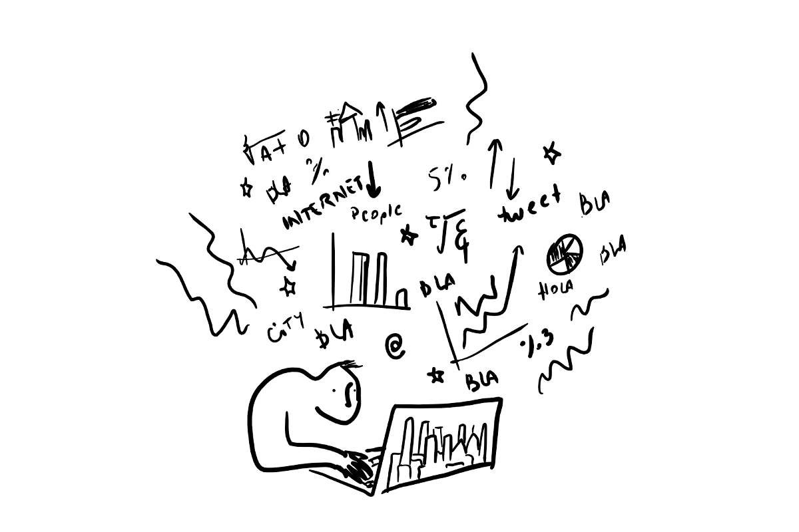

--- 
title: "Ciencia de Datos y Políticas Públicas"
author: "Antonio Vazquez Brust"
date: "`r Sys.Date()`"
bibliography:
- book.bib
- packages.bib
documentclass: book
github-repo: datosgcba/ciencia-de-datos-politicas-publicas
link-citations: yes
site: bookdown::bookdown_site
subtitle: Una introducción a la exploración, análisis y visualización de datos
biblio-style: apalike
---

# {-}

```{r echo=FALSE, out.width="100%"}

```

Éste manual es una ["bifurcación"](https://es.wikipedia.org/wiki/Bifurcaci%C3%B3n_(desarrollo_de_software)) de [Ciencia de Datos para Gente Sociable](https://bitsandbricks.github.io/ciencia_de_datos_gente_sociable/). 

Su antecesor fue escrito para urbanistas, sociólogos, politólogas y otros entusiastas que se acercan al tema desde las Ciencias Sociales; éste manual también, pero ajustado a una audiencia en particular: empleados y funcionarios del Gobierno de la Ciudad de Buenos Aires.


## Antes de empezar {-}

Para practicar los ejemplos que se explicarán a lo argo del libro no hace falta ningún conocimiento previo de programación; todas las herramientas necesarias serán explicadas sobre la marcha. 

Sólo es necesario instalar el [lenguaje de programación R](https://cloud.r-project.org/), y la interfaz gráfica [RStudio Desktop](https://www.rstudio.com/products/rstudio/download/). 

```{r include=FALSE}
# automatically create a bib database for R packages
knitr::write_bib(c(
  .packages(), 'bookdown', 'knitr', 'rmarkdown'
), 'packages.bib')
```
